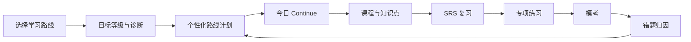

# HSKWise 产品方案

## 1. 产品定位

HSKWise 是一个面向非汉语母语者的专业 HSK 备考网站，围绕 HSK 等级标准提供诊断、课程、词汇、语法、听力、练习、模考、错题分析和 AI 辅导。

产品不是泛中文学习社区，而是目标明确的考试和能力提升工具。核心承诺是：帮助学习者知道自己在哪一级、下一步学什么、离目标考试还有多远。

## 2. 产品原则

- 目标先行：用户先选择目标，不先被迫理解 HSK 2.0 / HSK 3.0 差异。
- 路线驱动：主体验像 Brilliant 一样围绕一条学习路线推进，而不是让用户每天从扁平等级列表里选择。
- 底层融合：词汇和汉字用统一字词库管理；语法、话题、任务通过课程和课时承载。
- 双标准标签：同一内容可同时标记 HSK 2.0 等级、HSK 3.0 等级、考试高频、能力扩展。
- 课程规则统一：HSK 2.0 和 HSK 3.0 使用同一套 course/unit/section/scene 存储规范，只是学习内容和等级映射不同。
- 统一课件编辑器：图文页、互动题页、自动播放课件、吉祥物讲解和实时测验都用同一套 Course Studio scene 编辑器制作。
- 备考闭环：诊断、学习、复习、练习、模考、错题再训练必须连起来。
- 专业可信：HSK 词汇主数据和官方大纲都要能追溯到具体来源。

## 3. 目标用户

### 3.1 核心用户

- 准备参加 HSK 考试的海外学习者。
- 为申请学校、奖学金、工作签证或职业机会准备中文证明的人。
- 已经学过中文，但不知道自己真实 HSK 水平的自学者。
- 需要系统复习词汇、语法、听力和阅读的中级学习者。

### 3.2 次级用户

- 中文教师：用于备课、布置练习、追踪学生薄弱项。
- 培训机构：用于课程管理、班级学习报告和模考。
- 长期中文学习者：不急于考试，但希望按 HSK 3.0 标准系统提升。

## 4. 学习路线分流

首页和 onboarding 不直接问“选 HSK 2.0 还是 HSK 3.0”，也不把所有等级平铺给用户，而是先问用户要走哪条学习路线：

| 用户选择 | 产品推荐路径 | 说明 |
|---|---|---|
| Prepare for the current HSK exam | 当前考试备考路径 | 以考试通过为目标，优先覆盖高频题型和模考 |
| Study with the new HSK 3.0 standard | HSK 3.0 能力路径 | 按官方新版大纲构建长期能力 |
| I am not sure | 水平测试 | 先测词汇、语法、阅读、听力，再推荐路径 |

这个分流方式比让用户直接选择 HSK 2.0 / 3.0 或 HSK 1-6 更友好，因为大多数非汉语学习者并不了解版本差异，也不一定知道自己该从哪一级开始。

### 4.1 路线优先体验

产品主体验采用“路线 -> 当前步骤 -> 下一步”的结构：

- 用户先选路线，再在路线内设置目标等级、考试日期或学习节奏。
- 系统根据目标等级、诊断结果和已有基础生成学习计划。
- Dashboard 只突出一个主行动：`Continue`，进入今天最该完成的学习步骤。
- 词汇库、汉字库、等级资料保留为辅助工具，用于搜索、复习和高级筛选。
- 课程地图可以展示完整等级结构，但不作为新用户第一屏的主要选择方式。

例如用户准备 HSK 4，不直接进入“HSK 4 词汇列表”，而是进入一条备考路线：基础检测 -> HSK 1-3 缺口补齐 -> HSK 4 核心课程 -> 专项练习 -> 迷你模考 -> 错题回炉。

## 5. 核心学习闭环

## 6. MVP 功能范围

### 6.1 必做功能

- Google 登录：第一阶段只支持 Google，降低注册和找回密码成本。
- 多设备登录：同一账号允许在桌面、手机、平板同时学习，并支持退出当前设备或全部设备。
- 用户 onboarding：选择学习路线、目标等级、考试日期或学习节奏。
- 水平测试：用短测判断推荐起点。
- Dashboard：突出 `Continue`、今日任务、进度、streak、弱项、目标倒计时。
- 学习路线：按目标组织字词学习、课程、练习和模考；等级结构在路线内逐步展开。
- 词汇学习：汉字、拼音、释义、词性、等级、掌握状态。
- SRS 复习：新词、复习词、困难词自动排队。
- 课程内语法学习：语法、话题、任务进入课程 scene，在 `scene_data` 中以图文、音视频、互动或自动播放逻辑讲解、练习和回顾。
- 练习系统：选择题、填空、判断、匹配、听力题。
- 模考系统：按等级计时、分 section、自动评分。
- 错题本：按词汇、语法、听力、阅读归因并回流复习。

### 6.2 延后功能

- AI 口语陪练。
- AI 作文批改。
- 教师端和班级管理。
- 社区讨论。
- 移动端离线学习。
- 多语言完整本地化。

## 7. 主要页面

### 7.1 学习者端

- `/`：产品入口和路线分流。
- `/onboarding`：目标选择、水平自评、考试计划。
- `/dashboard`：学习总览。
- `/learn`：当前学习路线和今日继续学习入口。
- `/routes/:routeId`：某条学习路线的计划、阶段和进度。
- `/settings/profile`：个人资料、界面语言、学习偏好。
- `/settings/security`：登录设备、退出当前设备、退出全部设备。
- `/courses`：课程地图和等级资料辅助入口，不作为主学习入口。
- `/courses/:standardVersion/:standardLevel`：某标准版本下的等级课程资料，例如 `/courses/hsk3/1`。
- `/vocabulary`：词汇库。
- `/practice`：专项练习。
- `/review`：SRS 复习。
- `/mock-exams`：模考。
- `/mistakes`：错题本。
- `/progress`：能力分析。

### 7.2 后台与运营端

- `/admin/course-sources`：管理 textbook、官网大纲、教师教案等内部参考来源。
- `/admin/courses`：课程列表、目标标准、等级映射、发布状态。
- `/admin/courses/:courseId/outline`：课程 unit 和 section 结构编辑。
- `/admin/courses/:courseId/studio`：统一 Course Studio，参考来源资料重新制作结构化 scene。
- `/admin/course-review`：未匹配词、缺音频、版权状态、OCR 异常和待审核 scene。
- `/admin/questions`：题库管理。
- `/admin/exams`：模考试卷管理。
- `/admin/reports`：用户学习数据和内容质量报告。

## 8. 产品差异化

- HSK 2.0 / 3.0 融合视图：用户不用在两个体系之间来回切换。
- 路线驱动体验：用户每天只需要继续当前路线，不需要反复在等级菜单里做选择。
- 大纲可追溯：字词可追溯到数据源和官网字表；课程内容可追溯到内部参考来源、官方任务、话题和语法模块。
- 弱项驱动学习：不是线性刷课，而是根据错误和遗忘自动安排训练。
- 备考感强：目标日期、通过率预测、模考趋势、错题回炉。
- 面向非汉语者：界面语言、解释、例句和提示优先服务外国学习者。

## 9. 成功指标

### 9.1 MVP 指标

- 新用户完成 onboarding 比例。
- Google 登录成功率。
- 多设备 session 异常退出率。
- 新用户创建学习路线比例。
- Dashboard `Continue` 点击率。
- 首次水平测试完成率。
- 第 1 天完成学习任务比例。
- 第 7 天留存。
- 词汇复习完成率。
- 模考完成率。

### 9.2 成熟期指标

- 用户目标等级通过率。
- 模考成绩提升曲线。
- 错题二次正确率。
- 付费转化率。
- AI 口语/写作使用率。
- 教师端班级续费率。

## 10. 内容依据

官方 HSK 3.0 大纲已经拆分在 [HSK 3.0 大纲拆分索引](../hsk3-syllabus/README.md)。第一阶段词汇主数据优先来自 `/Users/yanglong/Documents/GitHub/complete-hsk-vocabulary`。课程制作参考资料位于 `docs/textbooks`，但受版权限制只能内部参考，发布课程内容需要重新创作或取得授权；课程存储规范见 [课程存储与 Admin 制课方案](06-course-storage-design.md)，Course Studio 开发计划见 [Course Studio 开发计划](07-course-studio-development-plan.md)。其中：

- [考试能力描述](../hsk3-syllabus/capability-description.md) 用于等级定位和营销解释。
- [任务大纲](../hsk3-syllabus/tasks/hsk-1.md) 用于课程任务设计。
- [话题大纲](../hsk3-syllabus/topics/hsk-1.md) 用于场景化课程和练习设计。
- [词汇大纲](../hsk3-syllabus/vocabulary/hsk-1.md) 用于校验词库等级和官方覆盖范围。
- [汉字大纲](../hsk3-syllabus/characters/recognition-hsk-1.md) 用于认读/书写训练。
- [语法大纲](../hsk3-syllabus/grammar/hsk-1.md) 用于课程内语法教学和后续题目归因。
