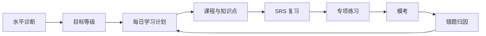

# HSKWise 产品方案

## 1. 产品定位

HSKWise 是一个面向非汉语母语者的专业 HSK 备考网站，围绕 HSK 等级标准提供诊断、课程、词汇、语法、听力、练习、模考、错题分析和 AI 辅导。

产品不是泛中文学习社区，而是目标明确的考试和能力提升工具。核心承诺是：帮助学习者知道自己在哪一级、下一步学什么、离目标考试还有多远。

## 2. 产品原则

- 目标先行：用户先选择目标，不先被迫理解 HSK 2.0 / HSK 3.0 差异。
- 底层融合：词汇、汉字、语法、话题、任务用统一内容库管理。
- 双标准标签：同一内容可同时标记 HSK 2.0 等级、HSK 3.0 等级、考试高频、能力扩展。
- 备考闭环：诊断、学习、复习、练习、模考、错题再训练必须连起来。
- 专业可信：官方大纲是内容事实源，产品解释要能追溯到具体大纲模块。

## 3. 目标用户

### 3.1 核心用户

- 准备参加 HSK 考试的海外学习者。
- 为申请学校、奖学金、工作签证或职业机会准备中文证明的人。
- 已经学过中文，但不知道自己真实 HSK 水平的自学者。
- 需要系统复习词汇、语法、听力和阅读的中级学习者。

### 3.2 次级用户

- 中文教师：用于备课、布置练习、追踪学生薄弱项。
- 培训机构：用于课程管理、班级学习报告和模考。
- 长期中文学习者：不急于考试，但希望按 HSK 3.0 标准系统提升。

## 4. 用户目标分流

首页和 onboarding 不直接问“选 HSK 2.0 还是 HSK 3.0”，而是问用户目标：

| 用户选择 | 产品推荐路径 | 说明 |
|---|---|---|
| Prepare for the current HSK exam | 当前考试备考路径 | 以考试通过为目标，优先覆盖高频题型和模考 |
| Study with the new HSK 3.0 standard | HSK 3.0 能力路径 | 按官方新版大纲构建长期能力 |
| I am not sure | 水平测试 | 先测词汇、语法、阅读、听力，再推荐路径 |

这个分流方式比让用户直接选择 HSK 2.0 / 3.0 更友好，因为大多数非汉语学习者并不了解版本差异。

## 5. 核心学习闭环

## 6. MVP 功能范围

### 6.1 必做功能

- 用户 onboarding：选择目标、目标等级、考试日期或学习节奏。
- 水平测试：用短测判断推荐起点。
- Dashboard：今日任务、进度、streak、弱项、目标倒计时。
- HSK 课程路径：按等级展示词汇、汉字、语法、话题、任务。
- 词汇学习：汉字、拼音、释义、词性、等级、掌握状态。
- SRS 复习：新词、复习词、困难词自动排队。
- 语法学习：按等级和类别浏览，支持收藏和练习。
- 练习系统：选择题、填空、判断、匹配、听力题。
- 模考系统：按等级计时、分 section、自动评分。
- 错题本：按词汇、语法、听力、阅读归因并回流复习。

### 6.2 延后功能

- AI 口语陪练。
- AI 作文批改。
- 教师端和班级管理。
- 社区讨论。
- 移动端离线学习。
- 多语言完整本地化。

## 7. 主要页面

### 7.1 学习者端

- `/`：产品入口和目标分流。
- `/onboarding`：目标选择、水平自评、考试计划。
- `/dashboard`：学习总览。
- `/courses`：等级课程列表。
- `/courses/hsk-:level`：某等级课程路径。
- `/vocabulary`：词汇库。
- `/grammar`：语法库。
- `/practice`：专项练习。
- `/review`：SRS 复习。
- `/mock-exams`：模考。
- `/mistakes`：错题本。
- `/progress`：能力分析。

### 7.2 后台与运营端

- `/admin/content`：内容导入和审核。
- `/admin/questions`：题库管理。
- `/admin/exams`：模考试卷管理。
- `/admin/reports`：用户学习数据和内容质量报告。

## 8. 产品差异化

- HSK 2.0 / 3.0 融合视图：用户不用在两个体系之间来回切换。
- 大纲可追溯：每个知识点可以追溯到官方任务、话题、词汇、汉字、语法模块。
- 弱项驱动学习：不是线性刷课，而是根据错误和遗忘自动安排训练。
- 备考感强：目标日期、通过率预测、模考趋势、错题回炉。
- 面向非汉语者：界面语言、解释、例句和提示优先服务外国学习者。

## 9. 成功指标

### 9.1 MVP 指标

- 新用户完成 onboarding 比例。
- 首次水平测试完成率。
- 第 1 天完成学习任务比例。
- 第 7 天留存。
- 词汇复习完成率。
- 模考完成率。

### 9.2 成熟期指标

- 用户目标等级通过率。
- 模考成绩提升曲线。
- 错题二次正确率。
- 付费转化率。
- AI 口语/写作使用率。
- 教师端班级续费率。

## 10. 内容依据

官方 HSK 3.0 大纲已经拆分在 [HSK 3.0 大纲拆分索引](../hsk3-syllabus/README.md)。其中：

- [考试能力描述](../hsk3-syllabus/00-capability-description.md) 用于等级定位和营销解释。
- [任务大纲](../hsk3-syllabus/tasks/hsk-1.md) 用于课程任务设计。
- [话题大纲](../hsk3-syllabus/topics/hsk-1.md) 用于场景化课程和练习设计。
- [词汇大纲](../hsk3-syllabus/vocabulary/hsk-1.md) 用于词库和 SRS。
- [汉字大纲](../hsk3-syllabus/characters/recognition-hsk-1.md) 用于认读/书写训练。
- [语法大纲](../hsk3-syllabus/grammar/hsk-1.md) 用于语法库和题目归因。

