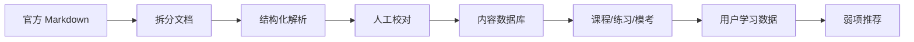

# 内容与数据方案

## 1. 内容事实源

当前仓库中的官方资料包括：

- [HSK3.0考试能力描述.md](../HSK3.0考试能力描述.md)
- [hsk3-syllabus/](../hsk3-syllabus/README.md)：已经拆分后的可查阅版本

HSK 3.0 大纲按五类内容组织：

- 任务大纲：学习者在生活、学习、工作、职业、学术场景中要完成的语言任务。
- 话题大纲：每个等级覆盖的话题层级。
- 词汇大纲：共 11000 个词条，按等级标注。
- 汉字大纲：认读字和书写字。
- 语法大纲：语素、词类、短语、句子成分、句型、复句、语段等。

## 2. 内容库设计原则

- 官方大纲字段不丢失：原等级标注、拼音、词性、标题、表格内容都应可追溯。
- 学习产品字段可扩展：在官方字段之外增加释义、例句、音频、难度、频率、题目关联。
- 同一内容可多标签：支持 HSK 3.0 等级、HSK 2.0 等级、考试路径、能力路径、技能项。
- 内容与题目分离：词汇、语法、汉字是知识点；题目引用知识点，不把知识点埋进题干。
- 先 Markdown 校验，后结构化入库：官方资料先在 `docs/hsk3-syllabus` 保持可读，再逐步导入数据库。

## 3. 核心内容模型

### 3.1 Level

| 字段 | 说明 |
|---|---|
| `id` | `hsk3-1`、`hsk3-2`、`hsk3-7-9` |
| `system` | `hsk3` 或 `hsk2` |
| `level` | 等级 |
| `title` | 展示名 |
| `abilityDescription` | 能力描述 |
| `order` | 排序 |

### 3.2 VocabularyItem

| 字段 | 说明 |
|---|---|
| `id` | 词条 ID |
| `word` | 词语 |
| `pinyin` | 拼音 |
| `partOfSpeech` | 词性 |
| `hsk3Level` | HSK 3.0 等级 |
| `hsk3RawLevel` | 原始等级标注，如 `3（5）` |
| `hsk2Level` | HSK 2.0 映射等级，可为空 |
| `definition` | 英文或多语言释义 |
| `examples` | 例句 |
| `audioUrl` | 音频 |
| `tags` | 高频、易混、口语、书面语等 |

### 3.3 CharacterItem

| 字段 | 说明 |
|---|---|
| `id` | 汉字 ID |
| `char` | 汉字 |
| `hsk3RecognitionLevel` | 认读等级 |
| `hsk3WritingLevel` | 书写等级 |
| `pinyin` | 常见读音 |
| `radical` | 部首 |
| `strokes` | 笔画 |
| `components` | 构件 |
| `sampleWords` | 关联词 |

### 3.4 GrammarPoint

| 字段 | 说明 |
|---|---|
| `id` | 语法点 ID |
| `title` | 标题 |
| `category` | 类别，如词类、短语、句型 |
| `subCategory` | 类别名称或细目 |
| `content` | 大纲原文内容 |
| `hsk3Level` | HSK 3.0 等级 |
| `hsk2Level` | HSK 2.0 映射等级，可为空 |
| `explanation` | 教学解释 |
| `patterns` | 结构公式 |
| `examples` | 例句 |

### 3.5 Topic 与 Task

| 模型 | 用途 |
|---|---|
| `Topic` | 话题树：一级话题、二级话题、三级话题 |
| `Task` | 任务能力：听、说、读、写、译相关能力描述 |
| `Scenario` | 场景：生活、学习、工作、学术等 |

任务和话题用于课程设计，也用于题目和 AI 练习的上下文。

### 3.6 Question

| 字段 | 说明 |
|---|---|
| `id` | 题目 ID |
| `type` | 选择、判断、填空、匹配、听力、阅读、写作、口语 |
| `skill` | listening、reading、writing、speaking、grammar、vocabulary |
| `level` | 推荐等级 |
| `prompt` | 题干 |
| `options` | 选项 |
| `answer` | 标准答案 |
| `explanation` | 解析 |
| `knowledgeRefs` | 关联词汇、语法、汉字、话题、任务 |
| `source` | 官方、原创、AI 辅助、教师上传 |

## 4. 词汇数量

根据拆分后的 [词汇大纲](../hsk3-syllabus/README.md)：

| 等级 | 新增词条数 |
|---|---:|
| HSK 1 | 300 |
| HSK 2 | 200 |
| HSK 3 | 500 |
| HSK 4 | 1000 |
| HSK 5 | 1600 |
| HSK 6 | 1800 |
| HSK 7-9 | 5600 |
| 合计 | 11000 |

产品展示时应同时支持新增词和累计词：

- 新增词：用于每级课程安排。
- 累计词：用于目标等级通过率和覆盖率计算。

## 5. HSK 2.0 / HSK 3.0 融合策略

产品不应把两个标准做成完全独立学习空间。推荐策略：

- 内容库以 HSK 3.0 官方大纲为长期主轴。
- 通过映射表给词汇、语法、题型增加 HSK 2.0 标签。
- 用户选择“当前考试备考”时，前台优先展示 HSK 2.0 考试路径和高频内容。
- 用户选择“新标准学习”时，前台按 HSK 3.0 等级展示。
- 同一个词条或语法点只维护一次，避免重复解释和进度割裂。

映射表建议单独维护：

| 字段 | 说明 |
|---|---|
| `contentType` | vocabulary、grammar、character、question |
| `contentId` | 内容 ID |
| `hsk2Level` | HSK 2.0 等级 |
| `hsk3Level` | HSK 3.0 等级 |
| `confidence` | official、manual、inferred |
| `note` | 说明 |

## 6. 学习进度模型

### 6.1 VocabularyProgress

- `new`：未学习。
- `learning`：学习中。
- `reviewing`：进入 SRS。
- `mastered`：稳定掌握。
- `leech`：反复错误，需要专项处理。

### 6.2 KnowledgeProgress

对语法、汉字、话题和任务统一记录：

- 完成状态。
- 正确率。
- 最近练习时间。
- 错误次数。
- 关联错题。
- 推荐复习时间。

### 6.3 ExamReadiness

目标等级的备考状态可由以下指标合成：

- 词汇覆盖率。
- 语法覆盖率。
- 听力正确率。
- 阅读正确率。
- 模考均分。
- 近三次模考趋势。
- 错题二次正确率。

## 7. 内容生产流程

## 8. MVP 内容范围

建议 MVP 先做 HSK 1-4：

- HSK 1-4 词汇导入。
- HSK 1-4 基础语法导入。
- HSK 1-4 认读字导入。
- HSK 1-4 任务和话题作为课程结构。
- 每级至少 1 套诊断题、3 套专项练习、1 套迷你模考。

HSK 5-6 和 7-9 可先作为资料浏览和搜索，等基础闭环稳定后再加入完整备考训练。
