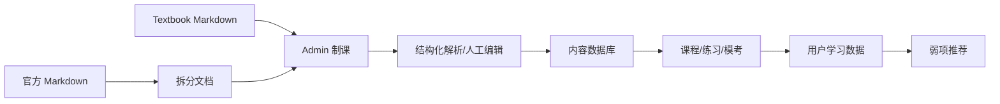

# 内容与数据方案

## 1. 内容事实源

当前第一阶段内容事实源包括：

- [考试能力描述](../hsk3-syllabus/capability-description.md)
- [hsk3-syllabus/](../hsk3-syllabus/README.md)：已经拆分后的可查阅版本
- `/Users/yanglong/Documents/GitHub/complete-hsk-vocabulary`：词汇、繁体、拼音、多转写、释义、量词、词频、词性、HSK 2.0/3.0 等级标签。
- `docs/textbooks`：HSK 2.0 / HSK 3.0 textbook 内部参考资料，用于后续 Admin 重新制作课程，不直接作为可发布内容源。

HSK 3.0 大纲按五类内容组织：

- 任务大纲：学习者在生活、学习、工作、职业、学术场景中要完成的语言任务。
- 话题大纲：每个等级覆盖的话题层级。
- 词汇大纲：共 11000 个词条，按等级标注。
- 汉字大纲：认读字和书写字。
- 语法大纲：语素、词类、短语、句子成分、句型、复句、语段等。

## 2. 内容库设计原则

- 公开数据字段不丢失：原等级标注、拼音、词性、标题、表格内容都应可追溯。
- 学习产品字段可扩展：在官方字段之外增加释义、例句、音频、难度、频率、题目关联。
- 音频当前缺失，先保留 URL 字段；未来整理后按读音 form 导入，避免多音词只挂一个音频。
- 笔画和笔顺不入库，需要展示时按需调用工具库生成。
- 同一内容可多标签：显式支持 `hsk3Level`、`hsk2Level`、考试路径、能力路径、技能项；HSK 标准版本和等级保留字符串，低基数内部枚举再使用数字码。
- 字词与课程分离：词汇、汉字适合结构化罗列；语法、话题、任务进入课程/课时内容，不在第一阶段单独建表。
- 课程与呈现分离：课程存为 course/unit/section/scene、`scene_data` 和引用关系，前端通过 ScenePlayer 再渲染成闪卡、递进模块、精读、自动播放课件或互动练习。
- 课程规则跨标准复用：HSK 2.0 和 HSK 3.0 共用同一套课程存储规范，通过 `standardVersion`、`standardLevel` 和 `course_level_mappings` 区分内容归属。
- 课程内容重新制作：textbook 只能指导章节顺序、教学重点和练习类型，发布内容必须是自制或已授权内容。
- 先 Markdown 校验，后结构化入库：官方资料先在 `docs/hsk3-syllabus` 保持可读，再逐步导入数据库。

## 3. 核心内容模型

当前代码中的字段定义和字段注释以 [src/db/schema/](/Users/yanglong/Documents/YL/hskwise/src/db/schema/) 中按表拆分的 schema 文件为准；[src/db/schema.ts](/Users/yanglong/Documents/YL/hskwise/src/db/schema.ts) 只负责统一导出。本节只描述内容模型的产品含义，并使用 Drizzle schema 中的属性名。

### 3.1 StandardLevel

| 字段 | 说明 |
|---|---|
| `id` | `hsk3-1`、`hsk3-2`、`hsk3-7-9` |
| `standardVersion` | 标准版本，例如 `hsk2`、`hsk3` |
| `standardLevel` | 该标准版本内的等级代码，例如 `1`、`6`、`7-9` |
| `title` | 展示名 |
| `abilityDescription` | 能力描述 |
| `sortOrder` | 排序，越小越靠前 |
| `vocabularyCount` | 当前等级新增词数 |
| `cumulativeVocabularyCount` | 到当前等级为止的累计词数 |
| `sourceDataset` | 主要数据来源数字码 |
| `metadata` | 来源文件、官方说明、修订备注等扩展 JSON |

命名上不要用泛称的 HSK 等级字段指代 HSK 3.0。目标、课程、题库等上下文用 `standardVersion + standardLevel`；官方内容字段用 `hsk2Level`、`hsk3Level` 明确区分。

`standardLevel` 是产品路径等级，可以表达高级合卷范围如 `7-9`；第一阶段 `hsk3Level` 也保留官方合并等级，入库取值为 `1`、`2`、`3`、`4`、`5`、`6`、`7-9`。如果后续官方或教研数据能稳定拆出七、八、九级，再单独调整 schema。

### 3.2 LexicalItem

| 字段 | 说明 |
|---|---|
| `id` | 词字条目 ID |
| `itemKind` | 条目类型数字码：`1 = vocabulary`，`2 = character` |
| `simplified` | 简体字串，对应 complete-hsk-vocabulary 的 `simplified` |
| `radical` | 主部首 |
| `hsk3Level` | HSK 3.0 等级，`new-7` 映射为 `7-9` |
| `hsk2Level` | HSK 2.0 映射等级，可为空 |
| `hsk3RecognitionLevel` | 汉字认读等级，通常只用于 `itemKind = 2` |
| `hsk3WritingLevel` | 汉字书写等级，通常只用于 `itemKind = 2` |
| `levelTags` | 原始等级标签，如 `["new-1","old-3"]` |
| `frequencyRank` | 词频排名 |
| `partOfSpeechTags` | 词性代码数组 |
| `primaryTraditional` | 首个 form 的繁体，便于列表展示 |
| `primaryPinyin` | 首个 form 的带调拼音 |
| `primaryNumericPinyin` | 首个 form 的数字声调拼音 |
| `primaryMeaning` | 首个释义，便于列表展示 |
| `primaryAudioUrl` | 首选读音音频 URL，便于列表和词卡直接播放 |
| `classifierWords` | 量词数组 |
| `components` | 构件数组，第一阶段可为空 |
| `sampleWords` | 例词数组，可由词汇记录反查生成 |
| `formsCount` | forms 数量，便于列表判断是否有多读音/多写法 |
| `sourceDataset` | 主要数据来源数字码 |
| `metadata` | 原始对象、来源文件、license 备注等 |

`itemKind` 是合并词汇和汉字的关键字段。同一个简体字串可以因为用途不同存在两条记录，例如 `爱` 可以既是词汇条目，也可以是汉字条目；入库时前者为 `1`，后者为 `2`。

### 3.3 LexicalForm

| 字段 | 说明 |
|---|---|
| `id` | form ID |
| `lexicalItemId` | 所属词字条目 |
| `traditional` | 繁体 |
| `pinyin` | 带调拼音 |
| `numericPinyin` | 数字声调拼音 |
| `wadeGiles` | Wade-Giles 转写 |
| `bopomofo` | 注音符号 |
| `romatzyh` | 国语罗马字 |
| `meanings` | 释义数组 |
| `classifiers` | 量词数组 |
| `audioUrl` | 当前 form 对应读音的音频 URL |
| `sortOrder` | form 排序 |
| `metadata` | 原始 form 或人工校正备注等扩展 JSON |

### 3.4 Course/Unit/Section/Scene（后续阶段）

课程存储规范见 [课程存储与 Admin 制课方案](06-course-storage-design.md)。推荐模型是：

```text
Course
  Unit
    Section
      Scene
        References
```

其中：

- `course_sources` 记录 textbook、官网大纲或教师教案等内部参考来源。
- `courses` 保存课程资产本身，不保存用户进度。
- `course_units` 对应重新制作后的课程单元；参考教材中的一课通常可映射为一个 unit。
- `course_sections` 对应课文、生词、语法、语音、汉字、练习、活动、小结等教学段落。
- `course_scenes` 保存最小可编辑、可播放、可交互、可记录的学习场景；`scene_data` 保存画布、元素、时间线、事件、动作、状态和互动。
- `course_scene_refs` 把 scene 内的元素、互动、行、题关联到 `lexical_items`、`lexical_forms`、`standard_levels` 或来源片段，内部定位统一使用 `target_locator`。

语法、话题、任务不作为第一阶段的独立内容表。它们进入 `course_scenes`：

- 语法讲解用 `sceneKind = grammar`，具体讲解、例句和互动放入 `scene_data.elements/interactions`。
- 话题场景用 `dialogue`、`reading`、`activity`、`interactive` 或 `scripted` scene 表达。
- 任务训练用 `exercise`、`activity` 或 `interactive` scene 表达。

textbook 内容受版权限制时，`course_scenes` 只保存 HSKWise 自制或已授权内容；来源文件、章节和行号只作为内部 `source_locator`，用于教研追溯和审核。

### 3.5 Question（后续阶段）

| 字段 | 说明 |
|---|---|
| `id` | 题目 ID |
| `type` | 选择、判断、填空、匹配、听力、阅读、写作、口语 |
| `skill` | listening、reading、writing、speaking、grammar、vocabulary |
| `standardVersion` | 推荐标准版本，例如 `hsk3` |
| `standardLevel` | 推荐等级代码，例如 `2` |
| `prompt` | 题干 |
| `options` | 选项 |
| `answer` | 标准答案 |
| `explanation` | 解析 |
| `knowledgeRefs` | 关联字词条目、课程 lesson、题目技能标签 |
| `source` | 官方、原创、AI 辅助、教师上传 |

## 4. 词汇数量

根据拆分后的 [词汇大纲](../hsk3-syllabus/README.md)：

| 等级 | 新增词条数 |
|---|---:|
| HSK 3.0 Level 1 | 300 |
| HSK 3.0 Level 2 | 200 |
| HSK 3.0 Level 3 | 500 |
| HSK 3.0 Level 4 | 1000 |
| HSK 3.0 Level 5 | 1600 |
| HSK 3.0 Level 6 | 1800 |
| HSK 3.0 Level 7-9 | 5600 |
| 合计 | 11000 |

产品展示时应同时支持新增词和累计词：

- 新增词：用于每级课程安排。
- 累计词：用于目标等级通过率和覆盖率计算。

## 5. HSK 2.0 / HSK 3.0 融合策略

产品不应把两个标准做成完全独立学习空间。推荐策略：

- 产品主体验以学习路线为中心，HSK 3.0 官方大纲作为长期能力主轴；词汇实体以 complete-hsk-vocabulary 为主数据。
- 字词条目直接维护 HSK 2.0 / HSK 3.0 标签；课程阶段再处理语法、话题、任务和题型的标准归属。
- 用户选择“当前考试备考”时，前台优先生成 HSK 2.0 考试路线和高频内容。
- 用户选择“新标准学习”时，前台按 HSK 3.0 能力路线逐步推进，等级作为路线阶段和筛选参数。
- 同一个字词条目只维护一次，避免释义、拼音和进度割裂。

## 6. 学习进度模型

### 6.1 VocabularyProgress

- `new`：未学习。
- `learning`：学习中。
- `reviewing`：进入 SRS。
- `mastered`：稳定掌握。
- `leech`：反复错误，需要专项处理。

### 6.2 KnowledgeProgress

后续课程阶段对 lesson、练习和考试表现统一记录：

- 完成状态。
- 正确率。
- 最近练习时间。
- 错误次数。
- 关联错题。
- 推荐复习时间。

### 6.3 ExamReadiness

目标等级的备考状态可由以下指标合成：

- 词汇覆盖率。
- 课程完成率。
- 听力正确率。
- 阅读正确率。
- 模考均分。
- 近三次模考趋势。
- 错题二次正确率。

## 7. 内容生产流程



## 8. MVP 内容范围

建议 MVP 先做 HSK 3.0 Level 1-4：

- HSK 3.0 Level 1-4 词汇导入。
- HSK 3.0 Level 1-4 认读字导入。
- HSK 3.0 Level 1-4 语法、任务、话题先保留在官方 Markdown 中，课程模块开发时再结构化。
- 每级至少 1 套诊断题、3 套专项练习、1 套迷你模考。

HSK 3.0 Level 5-6 和 HSK 3.0 Level 7-9 可先作为资料浏览和搜索，等基础闭环稳定后再加入完整备考训练。
