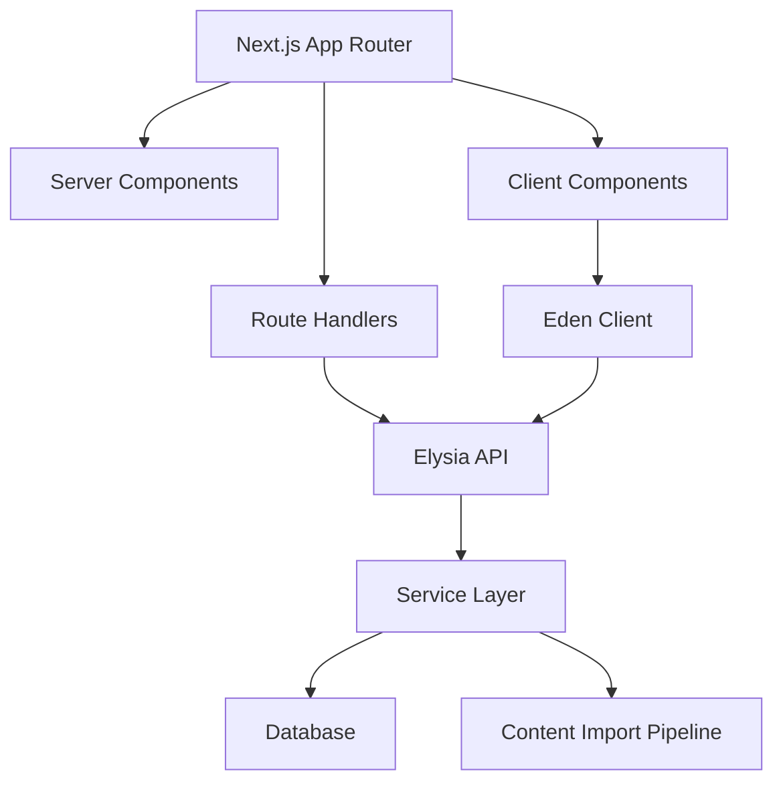

# 开发方案

## 1. 当前仓库状态

当前项目是一个轻量 Next.js 起步仓库，已经落地了基础登录入口、Elysia API 骨架和 Drizzle schema：

- Next.js `16.3.0`
- React `19.2.8`
- TypeScript
- Tailwind CSS 4
- shadcn/ui 配置
- Elysia + Eden，用于 `/api` 路由和类型安全客户端
- Drizzle + Turso/libSQL schema
- Google Identity Services 前端 SDK 登录入口
- Jotai 依赖已加入，状态管理方案可在后续功能中使用
- Bun 作为 package manager

当前代码状态：

| 模块 | 已实现 | 位置 |
|---|---|---|
| 首页 | 展示 HSKWise 登录入口和 API/db 状态 | [src/app/page.tsx](/Users/yanglong/Documents/YL/hskwise/src/app/page.tsx) |
| Google 登录按钮 | 使用 Google HTML SDK，`popup` 模式，固定按钮配置，仅 `locale` 作为 props | [src/components/google-login-button.tsx](/Users/yanglong/Documents/YL/hskwise/src/components/google-login-button.tsx) |
| Google credential callback | 注册 `window.handleGoogleCredentialResponse`，解析并打印 ID token payload | [src/hooks/use-google-credential-callback.ts](/Users/yanglong/Documents/YL/hskwise/src/hooks/use-google-credential-callback.ts) |
| Google 类型 | credential response、payload、按钮配置相关类型 | [src/types/google-identity.ts](/Users/yanglong/Documents/YL/hskwise/src/types/google-identity.ts) |
| API | 只提供 `/api/health` 和 `/api/db` | [src/app/api/[[...slugs]]/route.ts](/Users/yanglong/Documents/YL/hskwise/src/app/api/[[...slugs]]/route.ts) |
| 数据库 schema | 第一阶段用户/登录/目标/内容表，按表拆分，字段说明维护在代码注释中 | [src/db/schema/](/Users/yanglong/Documents/YL/hskwise/src/db/schema/) |
| Course Studio schema | 前端课程项目、scene、element、action、timeline、interaction、registry 和 sample project | [src/features/course-studio/scene-schema/](/Users/yanglong/Documents/YL/hskwise/src/features/course-studio/scene-schema/) |
| Course Studio 预览 | 基于 sample project 的 admin 预览页、ScenePlayer、元素渲染和互动模拟 | [src/app/admin/studio/page.tsx](/Users/yanglong/Documents/YL/hskwise/src/app/admin/studio/page.tsx) |

尚未实现：服务端 Google ID token 校验、用户 upsert、session 创建、退出登录、设备管理、内容导入脚本和真实学习路线页面。

课程存储与 Admin 制课方案已整理在 [课程存储与 Admin 制课方案](06-course-storage-design.md)，Course Studio 开发计划已整理在 [Course Studio 开发计划](07-course-studio-development-plan.md)。Course Studio 前端 JSON schema 已落地，课程后端表当前尚未写入 Drizzle schema。

重要约束：本仓库的 `AGENTS.md` 提醒 Next.js 版本存在破坏性变化，正式写 Next.js 代码前需要先阅读 `node_modules/next/dist/docs/` 中相关指南。

## 2. 推荐技术架构



## 3. 前端结构

当前已落地的前端文件比较扁平：

```text
src/
  app/
    page.tsx
    api/[[...slugs]]/route.ts
  components/
    google-login-button.tsx
    ui/
  hooks/
    use-google-credential-callback.ts
  types/
    google-identity.ts
    global.d.ts
```

随着功能变多，再逐步演进为按业务域组织：

```text
src/
  app/
    page.tsx
    dashboard/
    learn/
    routes/
    courses/
    vocabulary/
    practice/
    review/
    mock-exams/
    mistakes/
    progress/
    api/[[...slugs]]/route.ts
  components/
    app-shell/
    learning/
    practice/
    progress/
    ui/
  features/
    onboarding/
    learning-routes/
    courses/
    vocabulary/
    practice/
    review/
    exams/
    mistakes/
  lib/
    api/
    content/
    srs/
    scoring/
    utils.ts
```

## 4. API 模块

当前 Elysia API 只保留两个检查接口：

| 路径 | 职责 |
|---|---|
| `/api/health` | 健康检查，返回 `ok` |
| `/api/db` | 数据库配置状态占位，返回 Turso/Drizzle 信息 |

后续 API 建议按模块拆分后组合到 `app`：

| 模块 | 路径 | 职责 |
|---|---|---|
| Health | `/api/health` | 健康检查 |
| Auth | `/api/auth/*` | Google ID token 服务端校验、当前用户、退出登录、设备会话管理 |
| Standards | `/api/standards/levels` | 标准版本、等级、能力描述、统计 |
| Content | `/api/content/*` | 字词条目查询、等级筛选、搜索 |
| Course Admin | `/api/admin/course-*` | 内部参考来源、课程结构、Course Studio scene 编辑、引用绑定、发布审核 |
| Courses | `/api/courses/*` | 学习者端课程读取、课程地图、unit/scene 查询 |
| Onboarding | `/api/onboarding/*` | 目标设置、测级 |
| Learning Routes | `/api/learning-routes/*` | 用户学习路线、路线阶段、今日继续学习 |
| Progress | `/api/progress/*` | 用户进度 |
| Review | `/api/review/*` | SRS 队列 |
| Practice | `/api/practice/*` | 练习题和答题 |
| Exams | `/api/exams/*` | 模考、交卷、评分 |
| Mistakes | `/api/mistakes/*` | 错题本 |

## 5. 数据库方案

数据库采用 Turso Cloud，ORM 采用 Drizzle。Schema 按表拆分在 [src/db/schema/](/Users/yanglong/Documents/YL/hskwise/src/db/schema/)，字段和 enum 的维护说明以 schema 代码注释为准；[src/db/schema.ts](/Users/yanglong/Documents/YL/hskwise/src/db/schema.ts) 只作为统一导出；文档快照见 [数据库 Schema](05-db-schema.md)。

### 5.1 第一阶段表

- `users`
- `auth_accounts`
- `user_sessions`
- `user_profiles`
- `learning_goals`
- `standard_levels`
- `lexical_items`
- `lexical_forms`

### 5.2 后续阶段再加

这些表不需要为了 Course Studio 前端 MVP 立刻实现。Studio 可以先用本地 sample scenes、mock repository、browser storage 和 JSON 导入/导出验证体验；等编辑器和播放器稳定后再补 DB/API。

- 内容导入与审核：`content_sources`、`import_batches`、`content_review_notes`
- 学习路线：`learning_routes`、`learning_route_steps`、`user_route_progress`
- 课程编排与教学内容：`course_sources`、`courses`、`course_level_mappings`、`course_units`、`course_sections`、`course_scenes`、`course_scene_tags`、`course_scene_refs`
- 课程素材：`course_assets`，等音频和图片素材开始系统整理后再加
- 题库与练习：`questions`、`question_knowledge_refs`、`practice_sets`
- 模考：`exam_papers`、`exam_attempts`、`exam_answers`
- 学习进度、SRS、错题：`vocabulary_progress`、`knowledge_progress`、`review_cards`、`mistake_items`、`daily_activity`

## 6. MVP 页面开发顺序

### 6.1 第一步：可用产品骨架

- App shell：顶部导航、侧边栏、移动端导航。
- Google 登录入口和登录后用户态。
- 多设备 session 基础能力：当前设备、退出当前设备、退出全部设备。
- 首页路线分流。
- Onboarding 路线选择：当前考试备考、HSK 3.0 长期学习、不确定先测级。
- Dashboard 空状态和示例状态。
- `/learn` 当前路线页：一个主 `Continue` 动作、今日步骤、路线进度。
- HSK 3.0 Level 1 路线样例。

### 6.2 第二步：内容可浏览

- 词汇列表、搜索、等级筛选。
- 汉字认读/书写列表。
- 课程地图和等级资料作为辅助入口。
- 课程内语法、话题、任务内容按 [课程存储与 Admin 制课方案](06-course-storage-design.md) 中的 scene 模型加入。

### 6.3 第三步：Course Studio 前端体验

- `SceneSchema`、element registry、timeline action registry、interaction registry。
- `ScenePlayer` 和 admin 预览。
- `/admin/studio` 或 `/admin/courses/:courseId/studio` 前端入口。
- Mock course outline：course / unit / section / scene。
- 模板式 scene editor：拼音、对话、生词、选择题、跟读、角色扮演。
- Mock asset library：内置素材、临时 URL、缺失素材状态。
- Mock 知识点搜索和引用绑定。
- 本地保存、复制 scene、JSON 导入/导出。
- 前端预发布校验：schema 错误、缺音频、缺知识点绑定、无效素材 URL。

### 6.4 第四步：课程生产后台接入

- `/admin/course-sources`：登记 textbook、官网大纲和教师教案等内部参考来源。
- `/admin/courses`：课程列表、目标标准、等级映射、发布状态。
- `/admin/courses/:courseId/outline`：unit 和 section 结构编辑。
- `/admin/courses/:courseId/studio`：把前端 Studio 接入真实课程、scene 保存和读取。
- 字词搜索和引用绑定落库。
- 缺音频、未匹配词、版权状态、内容来源和 OCR 异常检查。
- 草稿预览和发布。

### 6.4 第四步：学习闭环

- 路线目标设置。
- 词汇学习状态。
- SRS 复习队列。
- 基础练习题。
- 错题记录。

### 6.5 第五步：备考闭环

- 迷你模考。
- 模考评分。
- 能力报告。
- 推荐复习计划。

## 7. 登录与会话

### 7.1 Google 登录

第一阶段只支持 Google 登录：

- 当前代码只接入前端 Google Identity Services HTML SDK，使用 `data-callback` 接收 credential。
- 当前 `ux_mode` 固定为 `popup`，因为前端 callback 解析 credential 与 popup 模式匹配。
- 当前 callback 只在浏览器解析并打印 Google ID token payload，尚未创建产品内登录态。
- 下一步需要把 credential 发到服务端，由服务端验证签名、`aud`、`iss`、`exp`、`email_verified` 后再创建用户和 session。
- `users` 是产品内用户主表，不直接使用 Google `sub` 作为用户主键。
- `auth_accounts.provider = google`，`provider_account_id` 存 Google OIDC `sub`。
- `users.email` 使用 Google 返回的邮箱初始化，并保持唯一。
- `users.display_name`、`users.avatar_url` 用 Google profile 初始化，后续允许用户在产品内修改。
- 第一阶段不保存 Google `access_token` / `refresh_token`，避免扩大敏感数据面。

### 7.2 多设备登录

多设备登录通过 `user_sessions` 管理：

- 每台设备一条 session，允许同一用户多条 `active` session。
- Cookie 中保存 session token，数据库只保存 `session_token_hash`。
- Dashboard 或设置页后续可显示设备名、最近活跃时间、地区。
- 退出当前设备只撤销当前 session；退出全部设备批量撤销该用户 active sessions。

## 8. 关键业务逻辑

### 8.1 SRS 复习

MVP 可先使用简化 SM-2：

- 初学成功：1 天后复习。
- 第二次成功：3 天后复习。
- 连续成功：间隔乘以 2-2.5。
- 回答错误：降级并尽快复习。
- 多次错误：标记 `leech`，进入专项训练。

### 8.2 推荐学习

推荐优先级：

1. 到期复习。
2. 当前学习路线的下一步必学内容。
3. 目标等级必学但未学内容。
4. 最近错题关联知识点。
5. 低正确率技能项。
6. 下一课新内容。

### 8.3 模考评分

MVP 先支持客观题自动评分：

- 选择题。
- 判断题。
- 匹配题。
- 填空题，先做精确匹配，后续支持近似匹配。

写作、口语、翻译可以先作为人工或 AI 评分扩展。

## 9. 设计系统方向

HSK 备考产品应偏工具型和专业型：

- 信息密度适中，适合长期学习和反复扫描。
- 色彩不做单一大面积红色或中国风堆叠。
- 重点突出当前路线、学习状态、目标进度、错题和下一步行动。
- Dashboard 主按钮是 `Continue`，弱化扁平等级入口。
- 图标使用 lucide-react。
- 组件优先使用现有 shadcn/ui 风格。
- 移动端优先保证每日学习、复习和练习流畅。

## 10. 质量与测试

### 10.1 自动化测试

- Auth 测试：Google 账号绑定唯一性、session token hash 校验、退出当前/全部设备。
- 内容解析测试：词汇总数、等级数量、必填字段。
- SRS 单元测试：正确/错误后间隔变化。
- 评分测试：题型评分、错题归因。
- API 类型测试：Elysia/Eden 返回类型。
- 页面冒烟测试：关键路由可渲染。

### 10.2 内容质量检查

- 词条重复检查。
- 拼音缺失检查。
- 词性缺失检查。
- 等级标注异常检查。
- 题目关联知识点缺失检查。

## 11. 风险与对策

| 风险 | 对策 |
|---|---|
| Google OAuth 配置和回调环境差异 | 本地、预览、生产分别配置 OAuth redirect URI |
| 多设备会话泄漏风险 | 只存 token hash，支持撤销单设备和全部设备 |
| HSK 2.0 / 3.0 让用户困惑 | 前台按学习路线分流，后台用双标签 |
| 官方 Markdown 表格结构不稳定 | 建立导入脚本和内容校验报告 |
| 题库质量不足 | 先做小题库闭环，再扩充题量 |
| AI 功能成本高 | MVP 只做规则评分和客观题，AI 放到付费层 |
| 学习路径过大 | 先做 HSK 3.0 Level 1-4，HSK 3.0 Level 5-6 与 HSK 3.0 Level 7-9 做资料浏览 |
| Next 16 API 变化 | 写代码前阅读本地 Next 文档，避免按旧经验实现 |

## 12. 近期开发清单

已完成或进行中：

- 数据库 schema 草案已建立，且字段说明已移到 [src/db/schema/](/Users/yanglong/Documents/YL/hskwise/src/db/schema/) 下的按表文件。
- Google 登录前端 SDK 入口已建立，当前可解析 credential payload。
- `.env.example` 已包含 `NEXT_PUBLIC_GOOGLE_CLIENT_ID`、Turso URL 和 token 配置项。

下一步优先：

- 实现服务端 Google ID token 校验。
- 基于 `users`、`auth_accounts`、`user_sessions` 完成登录态创建。
- 完成退出当前设备、退出全部设备的 API。
- 编写 complete-hsk-vocabulary 数据导入脚本。
- 编写官方汉字大纲解析脚本。
- 完成 HSK 3.0 Level 1-4 词汇和汉字数据导入。
- 搭建 App shell、首页路线分流、onboarding、Dashboard 和 `/learn` 当前路线页。
