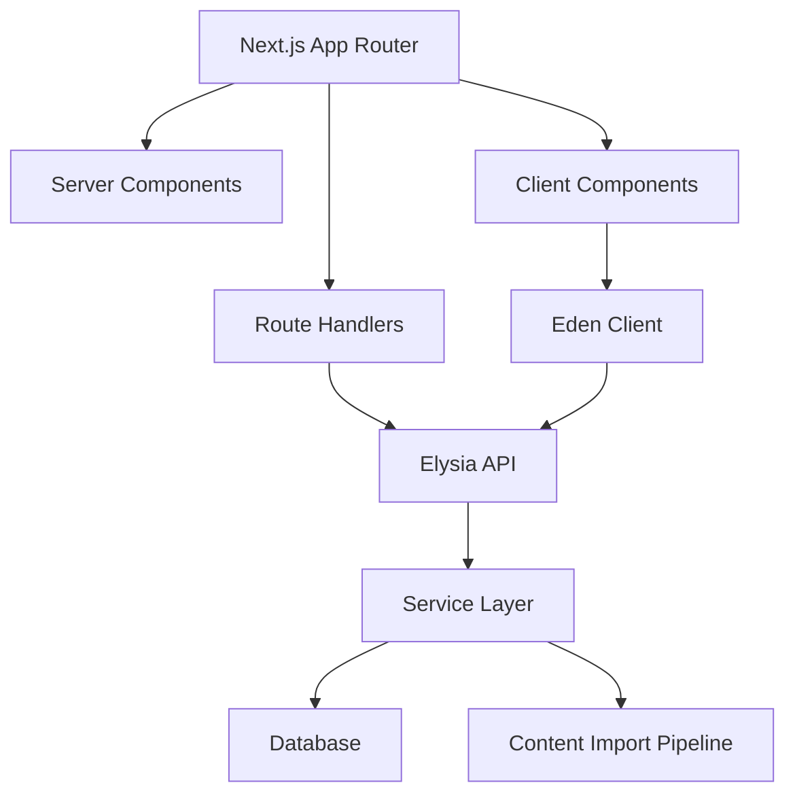

# 开发方案

## 1. 当前仓库状态

当前项目是一个轻量 Next.js 起步仓库：

- Next.js `16.3.0`
- React `19.2.8`
- TypeScript
- Tailwind CSS 4
- shadcn/ui 配置
- Elysia + Eden，用于 `/api` 路由和类型安全客户端
- Bun 作为 package manager

当前页面和 API 都很空，适合从产品骨架开始搭建。

重要约束：本仓库的 `AGENTS.md` 提醒 Next.js 版本存在破坏性变化，正式写 Next.js 代码前需要先阅读 `node_modules/next/dist/docs/` 中相关指南。

## 2. 推荐技术架构



## 3. 前端结构

建议采用按业务域组织：

```text
src/
  app/
    page.tsx
    dashboard/
    courses/
    vocabulary/
    grammar/
    practice/
    review/
    mock-exams/
    mistakes/
    progress/
    api/[[...slugs]]/route.ts
  components/
    app-shell/
    learning/
    practice/
    progress/
    ui/
  features/
    onboarding/
    courses/
    vocabulary/
    grammar/
    practice/
    review/
    exams/
    mistakes/
  lib/
    api/
    content/
    srs/
    scoring/
    utils.ts
```

## 4. API 模块

Elysia API 建议按模块拆分后组合到 `app`：

| 模块 | 路径 | 职责 |
|---|---|---|
| Health | `/api/health` | 健康检查 |
| Levels | `/api/levels` | 等级、能力描述、统计 |
| Content | `/api/content/*` | 词汇、语法、汉字、话题、任务查询 |
| Onboarding | `/api/onboarding/*` | 目标设置、测级 |
| Progress | `/api/progress/*` | 用户进度 |
| Review | `/api/review/*` | SRS 队列 |
| Practice | `/api/practice/*` | 练习题和答题 |
| Exams | `/api/exams/*` | 模考、交卷、评分 |
| Mistakes | `/api/mistakes/*` | 错题本 |

## 5. 数据库建议

MVP 推荐 PostgreSQL + Prisma 或 Drizzle。当前仓库还没有数据库依赖，可以在第一阶段确定。

### 5.1 基础表

- `users`
- `user_profiles`
- `learning_goals`
- `levels`
- `vocabulary_items`
- `character_items`
- `grammar_points`
- `topics`
- `tasks`
- `questions`
- `question_knowledge_refs`

### 5.2 学习数据表

- `vocabulary_progress`
- `knowledge_progress`
- `review_cards`
- `practice_attempts`
- `exam_attempts`
- `exam_answers`
- `mistake_items`
- `daily_activity`

### 5.3 内容导入表

- `content_sources`
- `import_batches`
- `content_mappings`
- `content_review_notes`

## 6. MVP 页面开发顺序

### 6.1 第一步：可用产品骨架

- App shell：顶部导航、侧边栏、移动端导航。
- 首页目标分流。
- Dashboard 空状态和示例状态。
- Courses 列表。
- HSK 1 课程详情。

### 6.2 第二步：内容可浏览

- 词汇列表、搜索、等级筛选。
- 语法列表、类别筛选。
- 汉字认读/书写列表。
- 任务和话题浏览。

### 6.3 第三步：学习闭环

- 用户目标设置。
- 词汇学习状态。
- SRS 复习队列。
- 基础练习题。
- 错题记录。

### 6.4 第四步：备考闭环

- 迷你模考。
- 模考评分。
- 能力报告。
- 推荐复习计划。

## 7. 关键业务逻辑

### 7.1 SRS 复习

MVP 可先使用简化 SM-2：

- 初学成功：1 天后复习。
- 第二次成功：3 天后复习。
- 连续成功：间隔乘以 2-2.5。
- 回答错误：降级并尽快复习。
- 多次错误：标记 `leech`，进入专项训练。

### 7.2 推荐学习

推荐优先级：

1. 到期复习。
2. 目标等级必学但未学内容。
3. 最近错题关联知识点。
4. 低正确率技能项。
5. 下一课新内容。

### 7.3 模考评分

MVP 先支持客观题自动评分：

- 选择题。
- 判断题。
- 匹配题。
- 填空题，先做精确匹配，后续支持近似匹配。

写作、口语、翻译可以先作为人工或 AI 评分扩展。

## 8. 设计系统方向

HSK 备考产品应偏工具型和专业型：

- 信息密度适中，适合长期学习和反复扫描。
- 色彩不做单一大面积红色或中国风堆叠。
- 重点突出学习状态、目标进度、错题和下一步行动。
- 图标使用 lucide-react。
- 组件优先使用现有 shadcn/ui 风格。
- 移动端优先保证每日学习、复习和练习流畅。

## 9. 质量与测试

### 9.1 自动化测试

- 内容解析测试：词汇总数、等级数量、必填字段。
- SRS 单元测试：正确/错误后间隔变化。
- 评分测试：题型评分、错题归因。
- API 类型测试：Elysia/Eden 返回类型。
- 页面冒烟测试：关键路由可渲染。

### 9.2 内容质量检查

- 词条重复检查。
- 拼音缺失检查。
- 词性缺失检查。
- 等级标注异常检查。
- 题目关联知识点缺失检查。

## 10. 风险与对策

| 风险 | 对策 |
|---|---|
| HSK 2.0 / 3.0 让用户困惑 | 前台按目标分流，后台用双标签 |
| 官方 Markdown 表格结构不稳定 | 建立导入脚本和内容校验报告 |
| 题库质量不足 | 先做小题库闭环，再扩充题量 |
| AI 功能成本高 | MVP 只做规则评分和客观题，AI 放到付费层 |
| 学习路径过大 | 先做 HSK 1-4，5-9 做资料浏览 |
| Next 16 API 变化 | 写代码前阅读本地 Next 文档，避免按旧经验实现 |

## 11. 近期开发清单

- 建立内容数据目录或数据库 schema。
- 编写官方大纲导入脚本。
- 完成 HSK 1-4 词汇数据导入。
- 搭建 App shell 和首页目标分流。
- 搭建 Dashboard。
- 搭建词汇库和等级课程页。
- 实现基础学习状态。
- 实现 SRS 复习队列。

