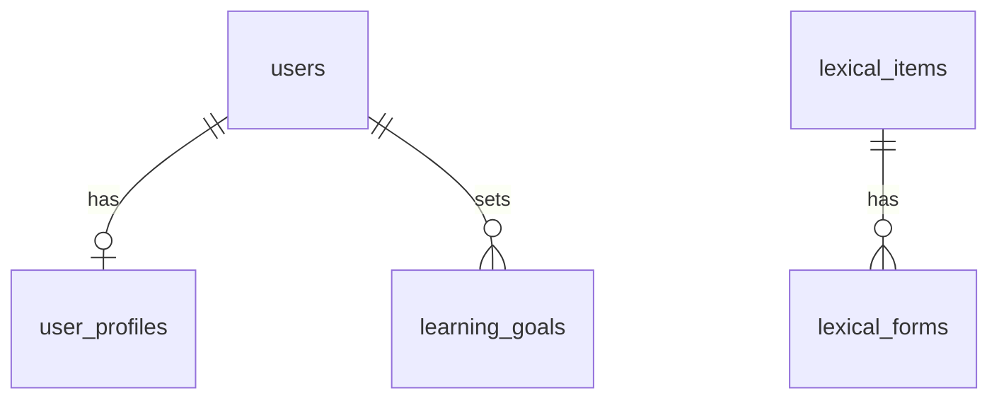

# 数据库 Schema

数据库采用 Turso Cloud，ORM 采用 Drizzle。代码版 schema 位于 [src/db/schema.ts](/Users/yanglong/Documents/YL/hskwise/src/db/schema.ts)。

当前是第一阶段 schema 草案，只保留“用户 + 内容数据表”。暂不生成迁移文件，等 schema 稳定后再手动运行：

```bash
bun run db:gen
bun run db:mig
```

## 数据来源

第一阶段按本地公开数据集重新设计：

| 来源 | 本地路径 | License | 入库表 |
|---|---|---|---|
| Complete HSK Vocabulary | `/Users/yanglong/Documents/GitHub/complete-hsk-vocabulary` | MIT | `lexical_items`、`lexical_forms` |
| 官网资料拆分文档 | `docs/hsk3-syllabus` | 官方资料 | `standard_levels`，以及 `lexical_items` 中的汉字认读/书写等级 |

如果以后分发 Complete HSK Vocabulary 的派生内容，需要保留对应开源项目的 MIT license 和版权声明。

## 第一阶段表

- 用户与目标：`users`、`user_profiles`、`learning_goals`
- 标准与词字：`standard_levels`、`lexical_items`、`lexical_forms`

以下能力先不进入 schema，等对应功能开发时再补：学习路线、导入批次、内容审核、课程编排、课时中的语法/话题/任务内容、题库、练习、模考、学习进度、SRS、错题。

## 设计原则

- 不用 `hsk` 泛称代表 HSK 3.0。目标上下文使用 `standard_version` + `standard_level`；明确的新旧标准内容映射使用 `hsk2_level`、`hsk3_level`。
- 枚举字段分层处理：HSK 标准版本和等级保留可读字符串；来源、角色、目标类型、目标状态、词字类型等低基数内部枚举使用整数码。
- `standard_version` 存 `hsk2` / `hsk3`，未来如果出现 HSK 4.0，可自然扩展为 `hsk4`。
- `hsk3_level` 第一阶段保留官方和 complete-hsk-vocabulary 的高级合并等级：数据库直接存 `7-9`。
- `lexical_items` 存词汇和汉字的通用主信息；用 `item_kind` 数字码区分 `vocabulary` 与 `character`。
- `lexical_forms` 存 complete-hsk-vocabulary 的 `forms[]`，避免多读音、多释义被压扁。
- HSK 词汇主数据优先来自 complete-hsk-vocabulary；官网资料补标准等级和汉字认读/书写等级。
- 语法、话题、任务不做独立罗列表。它们属于课程/课时里的教学内容，等课程 schema 阶段再设计。
- 同一个 `simplified` 可以因为 `item_kind` 不同存在两条记录，例如 `爱` 可同时作为词汇条目和汉字条目。
- 笔画、笔顺不入库。需要展示笔顺时，在应用层按需调用汉字工具库。
- 音频文件当前数据集缺失，先保留 URL 字段；整理音频后优先写入 `lexical_forms.audio_url`，并可同步首选读音到 `lexical_items.primary_audio_url`。
- 第一阶段不建导入批次表。来源文件、原始编码、license 备注等先放 `metadata`。
- Turso/libSQL 没有原生 JSON 类型，数组和扩展结构用 JSON text 存储。

## 公共字段

| 字段 | 说明 | 示例值 |
|---|---|---|
| `id` | 文本主键。内容类建议用可读 ID，用户目标可用 CUID/ULID。 | `lex:vocabulary:hsk3:爱好` |
| `created_at` | 创建时间，Unix seconds。 | `1785836534` |
| `updated_at` | 更新时间，Unix seconds。 | `1785836900` |
| `source_dataset` | 当前记录主要来自哪个数据源，使用 `sourceDatasetEnum` 数字码。 | `2` |
| `metadata` | 扩展 JSON。用于来源文件、原始编码、导入备注、license 片段等。 | `{"sourceFile":"complete.json"}` |

## Enum 项说明

Schema 中的 `standardVersionEnum`、`hsk2LevelEnum`、`hsk3LevelEnum` 是字符串枚举；其余低基数内部枚举导出为数字码表。数字码表中的“标签”用于代码可读性、UI 展示和导入脚本。

### 标准与来源

| Enum | 存储值 | 标签 | 说明 | 何时使用 |
|---|---|---|---|---|
| `standardVersionEnum` | `hsk2` | `hsk2` | 旧版 HSK 标准。 | 用户目标是 HSK 2.0 1-6，或内容需要旧版映射。 |
| `standardVersionEnum` | `hsk3` | `hsk3` | HSK 3.0 新标准。 | 新版大纲内容、长期能力路径。 |
| `hsk2LevelEnum` | `1`-`6` | `1`-`6` | HSK 2.0 一级到六级。 | `hsk2_level` 或旧版目标等级。 |
| `hsk3LevelEnum` | `1`-`6` | `1`-`6` | HSK 3.0 一级到六级。 | 新版 1-6 级内容。 |
| `hsk3LevelEnum` | `7-9` | `7-9` | HSK 3.0 七至九级合并范围。 | complete-hsk-vocabulary 的 `new-7` 和官网七至九级合并资料。 |
| `sourceDatasetEnum` | `1` | `officialHskSyllabus` | 官网 HSK 资料。 | 标准等级和汉字认读/书写等级。 |
| `sourceDatasetEnum` | `2` | `completeHskVocabulary` | Complete HSK Vocabulary。 | 词字通用条目和 forms。 |
| `sourceDatasetEnum` | `9` | `manual` | 人工维护。 | 后续人工补充、校正、映射。 |
| `lexicalItemKindEnum` | `1` | `vocabulary` | 词汇条目。 | 词、短语或作为词汇学习的单字。 |
| `lexicalItemKindEnum` | `2` | `character` | 汉字条目。 | 认读/书写字表中的单字。 |

### 用户与目标

| Enum | 存储值 | 标签 | 说明 | 何时使用 |
|---|---:|---|---|---|
| `userRoleEnum` | `1` | `learner` | 普通学习者。 | 默认角色。 |
| `userRoleEnum` | `2` | `teacher` | 教师或辅导者。 | 先预留，教师端再使用。 |
| `userRoleEnum` | `9` | `admin` | 管理员。 | 先预留，用于后续后台。 |
| `goalTypeEnum` | `1` | `currentExam` | 当前考试备考目标。 | 用户明确要准备现行 HSK 考试。 |
| `goalTypeEnum` | `2` | `standardLearning` | 按某个标准长期学习。 | 用户按 HSK 3.0 等标准系统提升。 |
| `goalTypeEnum` | `3` | `placement` | 测级目标。 | 用户不确定水平，先做诊断。 |
| `goalTypeEnum` | `4` | `teacherAssigned` | 教师指定目标。 | 教师端给学生设目标时使用。 |
| `goalStatusEnum` | `1` | `active` | 目标正在执行。 | Dashboard 和推荐优先读取。 |
| `goalStatusEnum` | `2` | `paused` | 目标暂停。 | 用户暂时不学习。 |
| `goalStatusEnum` | `3` | `completed` | 目标完成。 | 达成目标等级或完成考试。 |
| `goalStatusEnum` | `4` | `abandoned` | 目标放弃。 | 保留历史，但不参与推荐。 |

## 字段说明

### Users

| 表 | 字段 | 必填 | 说明 | 示例值 |
|---|---|---:|---|---|
| `users` | `id` | 是 | 用户主键。接入认证后可沿用认证系统用户 ID。 | `user_01J...` |
| `users` | `email` | 是 | 登录邮箱，唯一。 | `ana@example.com` |
| `users` | `nickname` | 否 | 用户昵称。 | `Ana` |
| `users` | `avatar` | 否 | 用户头像 URL。 | `https://.../avatar.png` |
| `users` | `role` | 是，默认 `1` | 用户角色，使用 `userRoleEnum` 数字码。 | `1` |

### User Profiles

| 表 | 字段 | 必填 | 说明 | 示例值 |
|---|---|---:|---|---|
| `user_profiles` | `user_id` | 是 | 对应 `users.id`，一位用户最多一条 profile。 | `user_01J...` |
| `user_profiles` | `locale` | 是，默认 `en` | 用户界面语言。 | `en` |
| `user_profiles` | `current_standard_version` | 否 | 用户当前自评水平采用的标准版本。为空表示还未自评。 | `hsk3` |
| `user_profiles` | `current_standard_level` | 否 | 用户当前自评等级，必须结合版本理解。 | `2` |
| `user_profiles` | `self_assessment` | 否 | onboarding 问卷 JSON。 | `{"knownWords":300}` |
| `user_profiles` | `preferences` | 否 | 学习偏好 JSON。 | `{"showPinyin":true}` |

### Learning Goals

| 表 | 字段 | 必填 | 说明 | 示例值 |
|---|---|---:|---|---|
| `learning_goals` | `id` | 是 | 学习目标 ID。一个用户可以有多个历史目标。 | `goal_01J...` |
| `learning_goals` | `user_id` | 是 | 目标所属用户。 | `user_01J...` |
| `learning_goals` | `goal_type` | 是 | 目标类型，使用 `goalTypeEnum` 数字码。 | `1` |
| `learning_goals` | `target_standard_version` | 是 | 目标标准版本，不能默认。 | `hsk3` |
| `learning_goals` | `target_standard_level` | 是 | 目标等级代码。 | `4` |
| `learning_goals` | `target_exam_date` | 否 | 目标考试日期，Unix seconds。长期学习目标可为空。 | `1790784000` |
| `learning_goals` | `daily_minutes` | 是，默认 `20` | 每日计划学习分钟数。 | `25` |
| `learning_goals` | `status` | 是，默认 `1` | 目标状态，使用 `goalStatusEnum` 数字码。 | `1` |
| `learning_goals` | `started_at` | 是，默认当前时间 | 目标开始执行时间。 | `1785836534` |
| `learning_goals` | `completed_at` | 否 | 目标完成时间。 | `1790784000` |

### Standard Levels

| 表 | 字段 | 必填 | 说明 | 示例值 |
|---|---|---:|---|---|
| `standard_levels` | `id` | 是 | 标准等级记录 ID。 | `hsk3-1` |
| `standard_levels` | `standard_version` | 是 | 标准版本。 | `hsk3` |
| `standard_levels` | `standard_level` | 是 | 该标准内的等级代码。 | `7-9` |
| `standard_levels` | `title` | 是 | 展示名。 | `HSK 3.0 Level 1` |
| `standard_levels` | `ability_description` | 否 | 官方能力描述或产品摘要。 | `能用中文完成简单日常交流...` |
| `standard_levels` | `sort_order` | 是 | 排序值，越小越靠前。 | `10` |
| `standard_levels` | `vocabulary_count` | 是，默认 `0` | 当前等级新增词数。 | `300` |
| `standard_levels` | `cumulative_vocabulary_count` | 是，默认 `0` | 到该等级累计词数。 | `500` |
| `standard_levels` | `source_dataset` | 是，默认 `1` | 数据来源码。 | `1` |
| `standard_levels` | `metadata` | 否 | 来源文件、官方说明等。 | `{"source":"capability-description.md"}` |

### Lexical Items

对应 complete-hsk-vocabulary 的 `complete.json` 顶层词条，也承载官网汉字大纲中的单字条目。`item_kind` 数字码用来区分当前记录作为“词汇”还是“汉字”使用。

| 表 | 字段 | 必填 | 说明 | 示例值 |
|---|---|---:|---|---|
| `lexical_items` | `id` | 是 | 词字条目 ID。 | `lex:vocabulary:hsk3:爱好` |
| `lexical_items` | `item_kind` | 是 | 条目类型码，`1` 表示词汇，`2` 表示汉字。 | `1` |
| `lexical_items` | `simplified` | 是 | 简体字串，对应 `simplified`。 | `爱好` |
| `lexical_items` | `radical` | 否 | 主部首，对应 complete-hsk-vocabulary 的 `radical`。 | `爫` |
| `lexical_items` | `hsk2_level` | 否 | 从 `level` 中的 `old-*` 提取。 | `3` |
| `lexical_items` | `hsk3_level` | 否 | 从 `level` 中的 `new-*` 提取，`new-7` 映射为 `7-9`。 | `1` |
| `lexical_items` | `hsk3_recognition_level` | 否 | 官网 HSK 3.0 汉字认读等级；通常只用于 `item_kind = 2`。 | `1` |
| `lexical_items` | `hsk3_writing_level` | 否 | 官网 HSK 3.0 汉字书写等级；通常只用于 `item_kind = 2`。 | `1` |
| `lexical_items` | `level_tags` | 否 | 原始等级标签 JSON。 | `["new-1","old-3"]` |
| `lexical_items` | `frequency_rank` | 否 | 词频排名，数字越小越高频。 | `4902` |
| `lexical_items` | `part_of_speech_tags` | 否 | 原始词性代码 JSON，对应 `pos`。 | `["n","v"]` |
| `lexical_items` | `primary_traditional` | 否 | 首个 form 的繁体，便于列表展示。 | `愛好` |
| `lexical_items` | `primary_pinyin` | 否 | 首个 form 的带调拼音。 | `ài hào` |
| `lexical_items` | `primary_numeric_pinyin` | 否 | 首个 form 的数字声调拼音。 | `ai4 hao4` |
| `lexical_items` | `primary_meaning` | 否 | 首个释义，便于列表展示。 | `to like; to be fond of` |
| `lexical_items` | `primary_audio_url` | 否 | 首选读音音频 URL，便于词卡列表直接播放；未来从整理后的音频导入。 | `/audio/vocab/ai4-hao4.mp3` |
| `lexical_items` | `classifier_words` | 否 | 所有 forms 合并后的量词 JSON。 | `["个"]` |
| `lexical_items` | `components` | 否 | 构件 JSON，后续需要时再补；第一阶段可为空。 | `["爫","冖","友"]` |
| `lexical_items` | `sample_words` | 否 | 例词 JSON，可由 `item_kind = 1` 的记录反查生成。 | `["爱","爱好"]` |
| `lexical_items` | `forms_count` | 是，默认 `0` | forms 数量。 | `2` |
| `lexical_items` | `source_dataset` | 是 | 主要数据来源码。complete 词汇写 `2`；官网字表生成的汉字记录写 `1`。 | `2` |
| `lexical_items` | `metadata` | 否 | 原始对象、license、官方字表来源、校正备注等。 | `{"sourceFile":"complete.json"}` |

### Lexical Forms

对应 complete-hsk-vocabulary 的 `forms[]`。一个词条可能有多个 form，例如多读音、多繁体写法、多义项组合。

| 表 | 字段 | 必填 | 说明 | 示例值 |
|---|---|---:|---|---|
| `lexical_forms` | `id` | 是 | form ID。 | `lform:爱好:ai4-hao4` |
| `lexical_forms` | `lexical_item_id` | 是 | 所属词字条目。 | `lex:vocabulary:hsk3:爱好` |
| `lexical_forms` | `traditional` | 否 | 繁体，对应 `traditional`。 | `愛好` |
| `lexical_forms` | `pinyin` | 否 | 带调拼音。 | `ài hào` |
| `lexical_forms` | `numeric_pinyin` | 否 | 数字声调拼音。 | `ai4 hao4` |
| `lexical_forms` | `wade_giles` | 否 | Wade-Giles 转写。 | `ai⁴ hao⁴` |
| `lexical_forms` | `bopomofo` | 否 | 注音符号。 | `ㄞˋ ㄏㄠˋ` |
| `lexical_forms` | `romatzyh` | 否 | 国语罗马字。 | `ay haw` |
| `lexical_forms` | `meanings` | 否 | 英文释义 JSON。 | `["interest; hobby"]` |
| `lexical_forms` | `classifiers` | 否 | 量词 JSON。 | `["个"]` |
| `lexical_forms` | `audio_url` | 否 | 当前 form 对应读音的音频 URL；同一词条多读音时应分别维护。 | `/audio/vocab/ai4-hao4.mp3` |
| `lexical_forms` | `sort_order` | 是，默认 `0` | form 排序。 | `0` |
| `lexical_forms` | `metadata` | 否 | 原始 form 或校正备注。 | `{"source":"complete.json"}` |

## 核心关系


