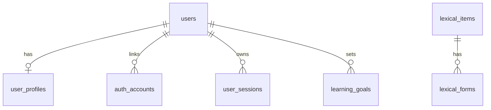

# 数据库 Schema

数据库采用 Turso Cloud，ORM 采用 Drizzle。当前 schema 的唯一事实来源是 [src/db/schema.ts](/Users/yanglong/Documents/YL/hskwise/src/db/schema.ts)，字段和 enum 的维护说明也写在 schema 代码注释里。

当前仍是第一阶段 schema 草案。暂不生成迁移文件，等 schema 稳定后再手动运行：

```bash
bun run db:gen
bun run db:mig
```

## 当前代码边界

- 已有 schema：用户、Google 账号绑定、多设备 session、用户 profile、学习目标、HSK 标准等级、词字主表、词字 form 表。
- 已有代码注释：每个 enum 值、关键字段、表用途、示例值和维护边界都在 [src/db/schema.ts](/Users/yanglong/Documents/YL/hskwise/src/db/schema.ts) 内维护。
- 未生成 migration：当前仓库没有基于最新 schema 生成迁移。
- 未实现服务端登录闭环：Google 前端 SDK 已接入，但后端 ID token 校验、用户 upsert、session 创建还没实现。

## 数据来源

| 来源 | 本地路径 | License | 入库表 |
|---|---|---|---|
| Complete HSK Vocabulary | `/Users/yanglong/Documents/GitHub/complete-hsk-vocabulary` | MIT | `lexical_items`、`lexical_forms` |
| 官网资料拆分文档 | `docs/hsk3-syllabus` | 官方资料 | `standard_levels`，以及 `lexical_items` 中的汉字认读/书写等级 |

如果以后分发 Complete HSK Vocabulary 的派生内容，需要保留对应开源项目的 MIT license 和版权声明。

## 第一阶段表

| 分组 | 表 | 当前用途 |
|---|---|---|
| 用户与登录 | `users` | 产品内用户主表。Google 登录最终落到这里，不直接用 Google `sub` 当用户主键。 |
| 用户与登录 | `auth_accounts` | 第三方账号绑定表。第一阶段只支持 `google`，`provider_account_id` 存 Google OIDC `sub`。 |
| 用户与登录 | `user_sessions` | 多设备 session 表。只存 `session_token_hash`，不存明文 session token。 |
| 用户与目标 | `user_profiles` | 用户界面语言、当前自评标准/等级、onboarding 问卷和学习偏好。 |
| 用户与目标 | `learning_goals` | 用户学习目标。支持路线驱动体验，一个用户可保留多个历史目标。 |
| 标准数据 | `standard_levels` | HSK 标准版本和等级元数据，例如 `hsk3 + 7-9`。 |
| 词字数据 | `lexical_items` | 词汇和汉字的合并主表，用 `item_kind` 区分词汇条目与汉字条目。 |
| 词字数据 | `lexical_forms` | 对应 complete-hsk-vocabulary 的 `forms[]`，用于多读音、多繁体写法和多义项。 |

以下能力先不进入 schema，等对应功能开发时再补：导入批次、内容审核、课程编排、课时中的语法/话题/任务内容、题库、练习、模考、学习进度、SRS、错题。

课程阶段的推荐扩展已单独整理在 [课程存储与 Admin 制课方案](06-course-storage-design.md)。核心思路是 `course_sources -> courses -> course_units -> course_sections -> course_blocks`，再用 `course_block_refs` 引用现有 `lexical_items` / `lexical_forms`，不新增 `grammar_points`、`topics`、`tasks` 罗列表。textbook 来源只作为内部参考，发布内容需要通过 block 的内容来源和版权状态确认。

## 当前字段快照

字段含义以 [src/db/schema.ts](/Users/yanglong/Documents/YL/hskwise/src/db/schema.ts) 中的代码注释为准。这里仅保留字段清单，方便快速检查 docs 是否与代码同名。

| 表 | 字段 |
|---|---|
| `users` | `id`, `email`, `email_verified_at`, `display_name`, `avatar_url`, `status`, `role`, `last_login_at`, `disabled_at`, `deleted_at`, `created_at`, `updated_at` |
| `auth_accounts` | `id`, `user_id`, `provider`, `provider_account_id`, `provider_email`, `provider_email_verified`, `provider_display_name`, `provider_avatar_url`, `linked_at`, `last_login_at`, `metadata`, `created_at`, `updated_at` |
| `user_sessions` | `id`, `user_id`, `session_token_hash`, `status`, `device_type`, `device_name`, `user_agent`, `ip_address`, `country_code`, `last_seen_at`, `expires_at`, `revoked_at`, `metadata`, `created_at`, `updated_at` |
| `user_profiles` | `user_id`, `locale`, `current_standard_version`, `current_standard_level`, `self_assessment`, `preferences`, `onboarding_completed_at`, `created_at`, `updated_at` |
| `learning_goals` | `id`, `user_id`, `goal_type`, `target_standard_version`, `target_standard_level`, `target_exam_date`, `status`, `started_at`, `completed_at`, `created_at`, `updated_at` |
| `standard_levels` | `id`, `standard_version`, `standard_level`, `title`, `ability_description`, `sort_order`, `vocabulary_count`, `cumulative_vocabulary_count`, `source_dataset`, `metadata`, `created_at`, `updated_at` |
| `lexical_items` | `id`, `item_kind`, `simplified`, `radical`, `hsk2_level`, `hsk3_level`, `hsk3_recognition_level`, `hsk3_writing_level`, `level_tags`, `frequency_rank`, `part_of_speech_tags`, `primary_traditional`, `primary_pinyin`, `primary_numeric_pinyin`, `primary_meaning`, `primary_audio_url`, `classifier_words`, `components`, `sample_words`, `forms_count`, `source_dataset`, `metadata`, `created_at`, `updated_at` |
| `lexical_forms` | `id`, `lexical_item_id`, `traditional`, `pinyin`, `numeric_pinyin`, `wade_giles`, `bopomofo`, `romatzyh`, `meanings`, `classifiers`, `audio_url`, `sort_order`, `metadata`, `created_at`, `updated_at` |

## Enum 快照

| Enum | 当前值 |
|---|---|
| `standardVersionEnum` | `hsk2`, `hsk3` |
| `hsk2LevelEnum` | `1`, `2`, `3`, `4`, `5`, `6` |
| `hsk3LevelEnum` | `1`, `2`, `3`, `4`, `5`, `6`, `7-9` |
| `authProviderEnum` | `google` |
| `sourceDatasetEnum` | `officialHskSyllabus = 1`, `completeHskVocabulary = 2`, `manual = 3` |
| `userStatusEnum` | `active = 1`, `disabled = 2`, `deleted = 3` |
| `userRoleEnum` | `learner = 1`, `teacher = 2`, `admin = 3` |
| `goalTypeEnum` | `currentExam = 1`, `standardLearning = 2`, `placement = 3`, `teacherAssigned = 4` |
| `goalStatusEnum` | `active = 1`, `paused = 2`, `completed = 3`, `abandoned = 4` |
| `sessionStatusEnum` | `active = 1`, `revoked = 2`, `expired = 3` |
| `deviceTypeEnum` | `unknown = 0`, `desktop = 1`, `mobile = 2`, `tablet = 3` |
| `lexicalItemKindEnum` | `vocabulary = 1`, `character = 2` |

## 设计原则

- 不用 `hsk` 泛称代表 HSK 3.0。目标上下文使用 `standard_version` + `standard_level`；明确的新旧标准内容映射使用 `hsk2_level`、`hsk3_level`。
- HSK 标准版本和等级保留可读字符串；来源、用户状态、角色、目标类型、目标状态、会话状态、设备类型、词字类型等低基数内部枚举使用整数码。
- `standard_version` 当前存 `hsk2` / `hsk3`，未来如果出现 HSK 4.0，可自然扩展为 `hsk4`。
- `hsk3_level` 第一阶段保留官方和 complete-hsk-vocabulary 的高级合并等级：数据库直接存 `7-9`。
- Google 登录使用 `auth_accounts` 绑定外部身份，`users` 始终是产品内用户主表。
- 多设备登录使用 `user_sessions` 支持一位用户多条活跃会话；退出某台设备时标记会话状态，不删除历史。
- 第一阶段不保存 Google `access_token` / `refresh_token`。如果以后要调用 Google API，再设计加密 token 存储。
- `lexical_items` 存词汇和汉字的通用主信息；用 `item_kind` 数字码区分 `vocabulary` 与 `character`。
- `lexical_forms` 存 complete-hsk-vocabulary 的 `forms[]`，避免多读音、多释义被压扁。
- HSK 词汇主数据优先来自 complete-hsk-vocabulary；官网资料补标准等级和汉字认读/书写等级。
- 语法、话题、任务不做独立罗列表。它们属于课程/课时里的教学内容，等课程 schema 阶段再设计。
- 同一个 `simplified` 可以因为 `item_kind` 不同存在两条记录，例如 `爱` 可同时作为词汇条目和汉字条目。
- 笔画、笔顺不入库。需要展示笔顺时，在应用层按需调用汉字工具库。
- 音频文件当前数据集缺失，先保留 URL 字段；整理音频后优先写入 `lexical_forms.audio_url`，并可同步首选读音到 `lexical_items.primary_audio_url`。
- 第一阶段不建导入批次表。来源文件、原始编码、license 备注等先放 `metadata`。
- Turso/libSQL 没有原生 JSON 类型，数组和扩展结构用 JSON text 存储。

## 核心关系


