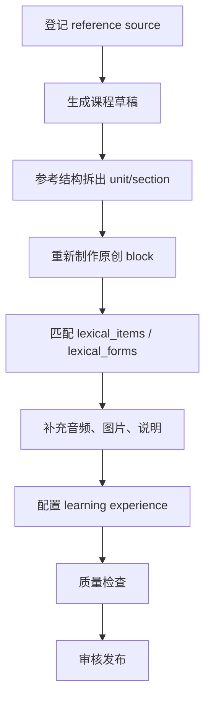

# 课程存储与 Admin 制课方案

## 1. 设计目标

当前阶段先解决“课程如何被稳定存储和生产”，暂不绑定最终前端呈现形式。后续课程可以被渲染成闪卡、递进式学习模块、精读课、练习流、复习任务或模考前补弱训练，但底层应共用一套结构化课程数据。

核心目标：

- 能参考 `docs/textbooks` 中的 HSK 2.0 / HSK 3.0 textbook 资料重新制作课程。
- 受版权限制，textbook 只作为内部教研参考，不把原文、原图、原音频直接写入可发布课程。
- HSK 2.0 和 HSK 3.0 使用同一套课程规则和存储规范，只是学习内容、标准版本和等级映射不同。
- 课程结构不依赖某一本教材的标题命名，避免 HSK 2.0、HSK 3.0、未来 HSK 4.0 之间再次割裂。
- 词汇和汉字仍引用现有 `lexical_items` / `lexical_forms` 主数据，不在课程里重复维护词条事实。
- 语法、话题、任务不做独立罗列表，作为课程 block 的教学内容保存。
- 在内容资产之外预留“学习体验配方”，让同一批 block 可以被组合成精读、闪卡、跟读、听写、角色扮演、课堂活动、AI 助学或考前补弱。
- Admin 后台能支持“参考资料 -> 原创制课 -> 引用字词 -> 审核 -> 发布”的生产流程。
- 版权和来源可追溯：textbook 是制课参考源，不是可直接发布的内容源。

## 2. 教材结构观察

`docs/textbooks` 当前包含：

| 路径 | 观察到的结构 |
|---|---|
| `docs/textbooks/hsk2/HSK-1-Textbook.md` | 课文、英文翻译、生词、专有名词、注释、语音、汉字、练习、活动。 |
| `docs/textbooks/hsk2/HSK-2-Textbook.md` | 场景对话、生词、语法点、替换练习、问答练习、语音和活动。 |
| `docs/textbooks/hsk3/hsk-course-1.md` | 目标、热身、课文 1/2/3、生词、小语讲堂、绕口令、综合练习、课堂活动、小语的彩蛋、学习小结。 |

进一步复盘后，需要特别吸收几类结构信号：

- HSK 2.0 教材强调“情景 + 对话 + 图片”，一级第 1-2 课偏语音入门，第 3-15 课通常包含热身、课文、生词、注释、练习、拼音、汉字、运用和文化板块。
- HSK 2.0 二级继续按任务主题组织，每课有多个场景，并包含看图说话、回答问题、完成句子、小组活动、语音重音/句调和汉字偏旁等训练。
- HSK 3.0 教材明确面向课堂教学、自主学习和 AI 助学，主干课本之外还有学练手册、数字教材、音频、视频、互动内容和补充练习。
- HSK 3.0 每课通常有三篇情景对话，语言点随文讲练，综合练习可以课上完成也可以课后完成，课堂活动承担双人/多人/角色扮演任务，每三课有学习小结。

这些信息说明：课程 schema 不能只保存“教材目录顺序”，还要让前端知道每个内容块适合什么技能、模式、场景和交互方式。否则后面做精读、听力、跟读、闪卡、课堂任务、AI 助教时会不断把临时规则写进前端。

虽然 HSK 2.0 和 HSK 3.0 的教材包装不同，但课程规则可以完全一致，并抽象为同一棵课程树：

```text
Course
  Unit / Lesson
    Section
      Block
        References
  Experience
    ExperienceStep -> Block / Section / Asset / Reference
```

例如：

- `Course`：HSK 3.0 一级入门课程。
- `Unit`：第 1 课 “基础问候与拼音入门”。
- `Section`：学习目标、原创对话、生词、拼音讲解、综合练习。
- `Block`：一段对话、一个生词列表、一个语法讲解、一组练习题。
- `References`：这个 block 讲了哪些 `lexical_items`，练了哪些 `lexical_forms`，对应哪个来源片段。
- `Experience`：同一课的学习体验配方，例如“引导式学习”“课前预习”“听力跟读”“角色扮演”“课后练习”。
- `ExperienceStep`：体验中的一个学习动作，引用某个 block、block 内某一行/题、某个素材或某组引用。

## 3. 课程与路线的关系

课程和学习路线要分开：

- 课程是内容资产，回答“这节课有哪些教学内容”。
- 学习路线是用户计划，回答“用户今天学哪一节、先后顺序是什么、什么时候复习和练习”。

这样做的好处是同一套课程可以被多个路线复用：

- 当前 HSK 考试备考路线可以优先使用 HSK 2.0 相关课程和题型训练。
- HSK 3.0 长期能力路线可以使用 HSK 3.0 大纲和新版教材结构。
- 测级后补弱路线可以只抽取某些 unit 或 block 给用户补课。

HSK 2.0 和 HSK 3.0 不需要两套课程表，也不需要两套 block 规则。它们的差异应体现在：

- `primary_standard_version` 和 `primary_standard_level`。
- `course_level_mappings` 中的跨标准覆盖关系。
- unit / section / block 中实际选择的词汇、语法、任务和题型。
- 学习路线对课程内容的编排顺序。

### 3.1 内容、体验、路线三层分离

为了适应后续前端的多种学习模式，建议再把“课程内容”和“学习路线”之间拆出一层“学习体验配方”：

| 层级 | 回答的问题 | 推荐表 |
|---|---|---|
| 课程内容资产 | 这门课有哪些稳定内容、知识点、素材和来源？ | `courses`、`course_units`、`course_sections`、`course_blocks`、`course_block_refs` |
| 学习体验配方 | 同一批内容如何被组织成一次可播放/可练习的体验？ | `course_experiences`、`course_experience_steps` |
| 用户学习路线 | 某个用户今天为什么学这个、什么时候复习、错题回到哪里？ | 后续 `learning_routes`、`learning_route_steps`、`user_route_progress` |

这样做可以避免两个常见问题：

- 不把 `course_blocks` 做成前端组件配置表。block 保存教学内容本身，experience step 保存学习动作和交互意图。
- 不让用户路线直接背负所有展示规则。路线只决定“选哪套体验、按什么节奏推给谁”，体验配方决定“这一课在精读/闪卡/听力/角色扮演里怎样使用内容”。

例如同一个 `dialogue` block 可以被多个 experience step 复用：

- 在 `guidedLesson` 中先完整展示汉字、拼音、翻译和场景说明。
- 在 `listeningDrill` 中只播放音频并隐藏部分文本。
- 在 `shadowing` 中按句播放、录音、回放和评分。
- 在 `rolePlay` 中隐藏某个角色的台词，让学习者扮演角色。
- 在 `review` 中只抽取错过的句子和相关词汇。

## 4. 存储原则

### 4.1 结构化优先

课程不能只存一大段 Markdown。Markdown 适合人工参考，但产品运行时需要能回答：

- 下一步学习是什么。
- 这一课包含哪些词、字、语法和练习。
- 哪些内容缺音频。
- 用户错题应该回流到哪一个 block。
- 一个 block 是否能被渲染成闪卡、练习题或精读片段。

所以课程应使用关系表保存层级、顺序、状态和引用关系，再用 JSON text 保存不同 block 类型的细节内容。

### 4.2 不把呈现方式写死

`blockKind` 只描述教学内容类型，例如 `dialogue`、`vocabularyList`、`grammarNote`、`exercise`。前端可以根据同一个 block 选择不同 renderer：

- `vocabularyList` 可渲染为生词表、闪卡队列或课前预习。
- `dialogue` 可渲染为精读、跟读、听力填空或角色扮演。
- `grammarNote` 可渲染为讲解卡片、例句练习或错题回顾。
- `exercise` 可渲染为普通练习、课后测验或弱项训练。

真正和学习体验相关的信息应放在 `course_experiences` / `course_experience_steps`，或作为 block 的教学标签维护，而不是把 React 组件名、页面布局或具体 UI 状态写进 `course_blocks.content`。

建议区分三类信息：

| 信息 | 放在哪里 | 示例 |
|---|---|---|
| 内容事实 | `course_blocks.content` | 对话行、例句、题干、选项、答案。 |
| 可查询教学标签 | `course_block_tags` | `skill=listening`、`learningMode=shadowing`、`scenario=classroom`、`topic=greetings`。 |
| 补充教学说明 | `course_blocks.pedagogy` | 教研备注、推荐讲法、低频配置、标签生成来源。 |
| 体验编排 | `course_experience_steps.config` | 是否隐藏拼音、是否逐句播放、角色扮演时隐藏哪个 speaker、听写时挖空哪些词。 |

`pedagogy` JSON 可以保留，但不建议把它作为前端高频筛选、推荐和统计的主要依据。Turso/libSQL 中 JSON text 不适合稳定索引，后续如果经常按技能、学习模式、场景、话题、难度筛选 block，应以 `course_block_tags` 为准；`pedagogy` 只保存不常查询的教研补充信息。

### 4.3 字词引用主数据

课程里的生词列表应引用 `lexical_items` / `lexical_forms`，而不是复制完整词汇对象。课程可以保存少量教学覆盖信息，例如本课展示释义、教材序号、是否专有名词，但词条事实仍以字词库为准。

如果教材里出现主库未匹配的词，应先存为 block 内的 `unmatchedTerms` 或进入 Admin 审核队列，确认后再补入主库或标记为课程专属表达。

### 4.4 版权与来源可追溯

textbook Markdown 应被视为内部制课参考。课程表需要保存来源指针，例如来源文件、章节、行号、页码、音频编号，但发布内容必须重新制作或确认授权。

例如制作拼音学习章节时，可以参考 textbook 如何安排声母、韵母、声调、跟读和练习顺序；但 `course_blocks.content` 中保存的讲解文案、例句、练习题、图片和音频，应是 HSKWise 自制内容或已授权内容。

特别注意：当前 Markdown 中的远程图片 URL 带临时授权参数，不适合作为生产素材 URL。正式课程如需图片、音频，应上传到稳定对象存储，再写入课程 asset 或 block 的 `audio_url` / `image_url`。

Admin 发布检查应把 `course_sources.copyright_status = referenceOnly` 视为硬约束：这种来源只能用于 `source_locator` 和教研备注，不能证明 block 原文、图片或音频可直接展示给学习者。

### 4.5 内容内部保留粗粒度定位点

为了支持逐句音频、跟读评分、题目重做、错题回流和局部复习，`content` JSON 中的关键数组成员不能只靠下标定位。建议所有可被前端单独引用的教学子元素都有稳定 `id`：

- `dialogue.lines[].id`：用于逐句播放、角色扮演、听力填空、口语评分。
- `readingText.paragraphs[].id` / `sentences[].id`：用于精读高亮、句子讲解、阅读题定位。
- `exercise.questions[].id` / `options[].id`：用于答题记录、错题、解析和重做。
- `grammarNote.patterns[].id` / `examples[].id`：用于例句练习和错题回顾。
- `vocabularyList.items[].id`：用于课内词汇顺序、闪卡队列和未匹配词审核。

定位粒度到“行、句、段、题、选项、例句、词汇项”即可，不做 token / 字符级定位。中文分词、文本改写和例句调整都会让 token 级定位很脆，维护成本高于收益。需要点词释义时，前端可以基于当前文本临时分词，再通过 `course_block_refs` 中的词条引用做候选匹配。

`course_block_refs.content_locator` 应能指向这些稳定 ID，例如 `{"lineId":"line_1"}`、`{"sentenceId":"sent_1"}` 或 `{"questionId":"q1","optionId":"b"}`。当文本微调但语义位置不变时，尽量保留旧 ID；如果对应子元素被删除或大幅改写，用户进度、错题和 SRS 可以降级关联到当前 block 或 section，而不是依赖复杂版本快照恢复旧内容。

课程内容在早期会频繁调整，不建议为了每次小改动引入正式版本机制。MVP 阶段只保留当前发布内容和必要审计字段；历史版本、发布快照或内容 diff 等机制等课程稳定、付费学习记录或合规审计真正需要时再考虑。

### 4.6 素材不要只挂一个 URL

单个 `audio_url` / `image_url` 可以作为 MVP 快捷字段，但多模式学习很快会需要更细的素材挂载：

- 同一段对话可能有整段音频、逐句音频、慢速音频、角色音频和跟读示范音频。
- 同一练习可能需要题干图、选项图、解析图或课堂投屏图。
- 同一拼音/汉字 block 可能需要动画、示范视频、笔画图和练习纸。

因此正式进入听力、口语、角色扮演或数字教材体验前，建议使用 `course_assets` + `course_asset_refs` 表达素材与 course / unit / section / block / experience step 的关系。`course_blocks.audio_url` 和 `image_url` 只作为过渡字段，不作为长期唯一素材模型。

## 5. 推荐表结构

这一组表建议作为“课程阶段”的 schema 扩展，不进入当前第一阶段 user + 字词 schema。字段注释未来应写进 `src/db/schema.ts`，本文件先作为设计规范。

### 5.1 course_sources

记录课程制作参考源，例如 textbook、官网大纲、人工教案。

| 字段 | 类型建议 | 说明 | 示例 |
|---|---|---|---|
| `id` | text PK | 来源 ID。 | `src_hsk3_course_1` |
| `source_kind` | integer enum | 来源类型，见 `courseSourceKindEnum`。 | `1` |
| `title` | text | 来源标题。 | `HSK Course 1` |
| `standard_version` | text enum | 主要对应标准，见 `standardVersionEnum`。 | `hsk3` |
| `standard_level` | text | 来源主要等级；高级合卷可为 `7-9`。 | `1` |
| `publisher` | text nullable | 出版方或来源机构。 | `北京语言大学出版社` |
| `edition` | text nullable | 版本、册次或出版信息。 | `Textbook 1` |
| `local_path` | text nullable | 本地参考文件路径。 | `docs/textbooks/hsk3/hsk-course-1.md` |
| `copyright_status` | integer enum | 授权状态，见 `copyrightStatusEnum`；textbook 默认应是 `referenceOnly`。 | `1` |
| `notes` | text nullable | 人工备注。 | `仅用于内部制课参考` |
| `metadata` | json text nullable | 扩展来源信息。 | `{"ocr":"paddleocr","lineCount":7516}` |
| `created_at` | integer | Unix seconds。 | `1785836534` |
| `updated_at` | integer | Unix seconds。 | `1785836534` |

### 5.2 courses

课程主表，只保存课程产品资产本身，不保存用户进度。

| 字段 | 类型建议 | 说明 | 示例 |
|---|---|---|---|
| `id` | text PK | 课程 ID。 | `course_hsk3_1_foundation` |
| `slug` | text unique | URL 和管理后台使用的稳定标识。 | `hsk3-1-foundation` |
| `title` | text | 课程标题。 | `HSK 3.0 Level 1 Foundation` |
| `subtitle` | text nullable | 副标题。 | `Greetings, names, numbers, and basic sentences` |
| `course_type` | integer enum | 课程类型，见 `courseTypeEnum`。 | `1` |
| `status` | integer enum | 发布状态，见 `courseStatusEnum`。 | `1` |
| `primary_standard_version` | text enum | 课程主目标标准。 | `hsk3` |
| `primary_standard_level` | text | 主目标等级。 | `1` |
| `source_id` | text FK nullable | 主要参考来源。 | `src_hsk3_course_1` |
| `description` | text nullable | 后台和课程地图使用的简介。 | `A beginner course for HSK 3.0 Level 1 goals.` |
| `estimated_minutes` | integer nullable | 预计总学习分钟数。 | `480` |
| `units_count` | integer | 冗余统计，便于列表展示。 | `15` |
| `sort_order` | integer | 同等级课程排序。 | `10` |
| `created_by_user_id` | text FK nullable | 创建课程的 admin / teacher 用户。 | `user_01J...` |
| `updated_by_user_id` | text FK nullable | 最近编辑用户。 | `user_01J...` |
| `published_at` | integer nullable | 发布时间。 | `1785836534` |
| `metadata` | json text nullable | 扩展配置，不放核心业务字段。 | `{"routeHint":"standardLearning"}` |
| `created_at` | integer | Unix seconds。 | `1785836534` |
| `updated_at` | integer | Unix seconds。 | `1785836534` |

### 5.3 course_level_mappings

课程与标准等级的映射表。不要在课程表里写一个泛称 `hsk_level`，这样未来 HSK 4.0 也能扩展。

| 字段 | 类型建议 | 说明 | 示例 |
|---|---|---|---|
| `id` | text PK | 映射 ID。 | `clm_01J...` |
| `course_id` | text FK | 所属课程。 | `course_hsk3_1_foundation` |
| `standard_version` | text enum | 标准版本。 | `hsk2` |
| `standard_level` | text | 对应等级。 | `1` |
| `mapping_role` | integer enum | 映射角色，见 `courseLevelMappingRoleEnum`。 | `2` |
| `coverage_percent` | integer nullable | 粗略覆盖比例，0-100。 | `80` |
| `notes` | text nullable | 说明。 | `覆盖 HSK2.0 一级大部分基础问候内容` |
| `created_at` | integer | Unix seconds。 | `1785836534` |
| `updated_at` | integer | Unix seconds。 | `1785836534` |

### 5.4 course_units

课程里的课、单元或模块。参考教材中的一课通常可以重新制作成一个 `course_unit`。

| 字段 | 类型建议 | 说明 | 示例 |
|---|---|---|---|
| `id` | text PK | 单元 ID。 | `unit_hsk3_1_001` |
| `course_id` | text FK | 所属课程。 | `course_hsk3_1_foundation` |
| `unit_no` | integer | 面向 admin 的单元序号。 | `1` |
| `title` | text | 单元标题。 | `基础问候与拼音入门` |
| `subtitle` | text nullable | 英文标题或补充说明。 | `Basic greetings and Pinyin` |
| `unit_kind` | integer enum | 单元类型，见 `courseUnitKindEnum`。 | `1` |
| `status` | integer enum | 单元发布状态，见 `courseStatusEnum`。 | `1` |
| `objectives` | json text nullable | 学习目标数组。 | `[{"lang":"zh-Hans","text":"能用基础问候语开始一次简单对话。"}]` |
| `estimated_minutes` | integer nullable | 预计学习分钟数。 | `35` |
| `source_locator` | json text nullable | 内部参考来源定位，不代表可发布内容授权。 | `{"path":"docs/textbooks/hsk3/hsk-course-1.md","heading":"目标 Objectives"}` |
| `sort_order` | integer | 课程内排序。 | `10` |
| `created_at` | integer | Unix seconds。 | `1785836534` |
| `updated_at` | integer | Unix seconds。 | `1785836534` |

### 5.5 course_sections

单元内的教学段落。它比 block 粗，比 unit 细，负责让 admin 和前端都能理解教学结构。

| 字段 | 类型建议 | 说明 | 示例 |
|---|---|---|---|
| `id` | text PK | section ID。 | `sec_hsk3_1_001_text1` |
| `unit_id` | text FK | 所属单元。 | `unit_hsk3_1_001` |
| `section_kind` | integer enum | 段落类型，见 `courseSectionKindEnum`。 | `2` |
| `title` | text | 段落标题。 | `原创对话` |
| `subtitle` | text nullable | 英文标题或补充说明。 | `Original Dialogue` |
| `status` | integer enum | 段落发布状态，见 `courseStatusEnum`。 | `1` |
| `source_locator` | json text nullable | 内部参考来源定位，不代表当前段落复制自来源。 | `{"lineStart":420,"lineEnd":520}` |
| `sort_order` | integer | 单元内排序。 | `20` |
| `created_at` | integer | Unix seconds。 | `1785836534` |
| `updated_at` | integer | Unix seconds。 | `1785836534` |

### 5.6 course_blocks

课程内容的最小可渲染单元。不同 block 的细节放在 `content` JSON 中。

| 字段 | 类型建议 | 说明 | 示例 |
|---|---|---|---|
| `id` | text PK | block ID。 | `blk_hsk3_1_001_text1_dialogue` |
| `section_id` | text FK | 所属 section。 | `sec_hsk3_1_001_text1` |
| `block_kind` | integer enum | 内容块类型，见 `courseBlockKindEnum`。 | `2` |
| `status` | integer enum | 内容块发布状态，见 `courseStatusEnum`。 | `1` |
| `title` | text nullable | 后台可读标题。 | `Office greeting dialogue` |
| `content` | json text | block 主内容。 | `{"version":1,"lines":[...]}` |
| `pedagogy` | json text nullable | 低频教学补充信息，不作为技能、模式、场景等高频查询的主要依据。 | `{"notes":"Good for first shadowing practice.","tagSource":"manual"}` |
| `content_origin` | integer enum | 当前 block 内容来源，见 `courseContentOriginEnum`；发布内容通常应为 `original`、`licensed`、`openLicensed`。 | `1` |
| `instruction` | json text nullable | 给学习者的操作说明。 | `{"en":"Read the dialogue aloud."}` |
| `answer` | json text nullable | 练习答案；非练习 block 为空。 | `{"correctOptionId":"b"}` |
| `explanation` | json text nullable | 解析或教研说明。 | `{"en":"Use 您 for respectful address."}` |
| `audio_url` | text nullable | MVP 过渡字段，block 级音频 URL；长期建议使用 `course_asset_refs`。 | `https://cdn.hskwise.com/audio/1-1.mp3` |
| `image_url` | text nullable | MVP 过渡字段，block 级图片 URL；必须是稳定可分发资源。 | `https://cdn.hskwise.com/images/unit-1-office.png` |
| `source_locator` | json text nullable | 内部参考来源定位，不代表当前 block 复制自来源。 | `{"path":"docs/textbooks/hsk3/hsk-course-1.md","lineStart":430,"lineEnd":470}` |
| `estimated_seconds` | integer nullable | 当前 block 作为普通学习内容时的预计耗时。 | `180` |
| `sort_order` | integer | section 内排序。 | `10` |
| `metadata` | json text nullable | 扩展信息。 | `{"referenceTopic":"greetings","ocrNeedsReview":false}` |
| `created_at` | integer | Unix seconds。 | `1785836534` |
| `updated_at` | integer | Unix seconds。 | `1785836534` |

### 5.7 course_block_tags

block 的轻量教学标签表。它是前端筛选、学习体验生成、推荐和统计的可查询索引层；`course_blocks.pedagogy` 只保存补充说明。

建议至少为常用筛选维度建标签：

- `skill`：listening、speaking、reading、writing、vocabulary、grammar、pronunciation、characters、interaction。
- `learningMode`：guidedLesson、preview、flashcards、intensiveReading、listeningDrill、shadowing、rolePlay、exerciseFlow、review、examPrep、aiTutor。
- `scenario`：classroom、campus、family、restaurant、shopping、travel、workplace 等情景。
- `topic`：greetings、family、numbers、time、weather、food、transport 等话题。
- `difficulty`：1、2、3 等粗略难度，或 future-ready 的文本标签。

| 字段 | 类型建议 | 说明 | 示例 |
|---|---|---|---|
| `id` | text PK | 标签 ID。 | `cbt_01J...` |
| `block_id` | text FK | 所属 block。 | `blk_hsk3_1_001_text1_dialogue` |
| `tag_kind` | integer enum | 标签类型，见 `courseBlockTagKindEnum`。 | `1` |
| `tag_value` | text | 标签值，建议使用稳定英文 slug。 | `listening` |
| `tag_label` | json text nullable | 标签的多语言显示名；可为空，优先由应用层字典提供。 | `{"zhHans":"听力","en":"Listening"}` |
| `weight` | integer nullable | 权重或强度；用于推荐和掌握度计算。 | `3` |
| `source` | integer enum nullable | 标签来源，见 `courseTagSourceEnum`。 | `1` |
| `display_order` | integer nullable | 同一 block 同类标签展示顺序。 | `1` |
| `metadata` | json text nullable | 扩展信息。 | `{"confidence":0.92}` |
| `created_at` | integer | Unix seconds。 | `1785836534` |
| `updated_at` | integer | Unix seconds。 | `1785836534` |

推荐索引：

- `idx_course_block_tags_kind_value`：`tag_kind` + `tag_value` + `block_id`，用于按技能、模式、场景快速找 block。
- `idx_course_block_tags_block_kind`：`block_id` + `tag_kind` + `display_order`，用于读取 block 时附带标签。
- 唯一约束 `block_id` + `tag_kind` + `tag_value`，避免重复标签。

### 5.8 course_block_refs

把 block 关联到词条、读音 form、标准等级或来源片段。学习进度、错题归因和复习推荐都可以依赖这张表。

| 字段 | 类型建议 | 说明 | 示例 |
|---|---|---|---|
| `id` | text PK | 引用 ID。 | `cbr_01J...` |
| `block_id` | text FK | 所属 block。 | `blk_hsk3_1_001_text1_dialogue` |
| `ref_type` | integer enum | 引用对象类型，见 `courseRefTypeEnum`。 | `1` |
| `ref_id` | text | 被引用对象 ID。 | `lex_nihao` |
| `ref_role` | integer enum | 引用角色，见 `courseRefRoleEnum`。 | `1` |
| `content_locator` | json text nullable | 引用在 block 内的粗粒度位置，用稳定 ID 定位行、句、段、题、选项或例句。 | `{"lineId":"line_1"}` |
| `mastery_weight` | integer nullable | 对掌握度计算的粗略权重；核心新知高于普通提及。 | `3` |
| `display_order` | integer nullable | 在当前 block 中的展示顺序。 | `1` |
| `metadata` | json text nullable | 教学补充信息。 | `{"isNewWord":true,"sourceOrder":1}` |
| `created_at` | integer | Unix seconds。 | `1785836534` |
| `updated_at` | integer | Unix seconds。 | `1785836534` |

### 5.9 course_assets

课程素材表。MVP 可以先不建，直接在 block 中放稳定 URL；但只要开始系统整理音频、图片、视频、互动资源，就建议建表。素材表保存“素材本身”，素材被哪个 block、哪一行、哪一道题使用，应通过 `course_asset_refs` 表达。

| 字段 | 类型建议 | 说明 | 示例 |
|---|---|---|---|
| `id` | text PK | 素材 ID。 | `asset_hsk3_1_001_audio_1_1` |
| `course_id` | text FK nullable | 所属课程。 | `course_hsk3_1_foundation` |
| `unit_id` | text FK nullable | 所属单元。 | `unit_hsk3_1_001` |
| `asset_kind` | integer enum | 素材类型，见 `courseAssetKindEnum`。 | `1` |
| `url` | text | 稳定素材 URL。 | `https://cdn.hskwise.com/audio/hsk3/1/1-1.mp3` |
| `duration_ms` | integer nullable | 音频/视频时长。 | `4300` |
| `mime_type` | text nullable | MIME 类型。 | `audio/mpeg` |
| `source_locator` | json text nullable | 来源定位或原始编号。 | `{"trackCode":"1-1"}` |
| `copyright_status` | integer enum | 授权状态。 | `3` |
| `metadata` | json text nullable | 扩展信息。 | `{"speaker":"female","speed":"normal"}` |
| `created_at` | integer | Unix seconds。 | `1785836534` |
| `updated_at` | integer | Unix seconds。 | `1785836534` |

### 5.10 course_asset_refs

素材挂载表。解决一个 block 只有一个 `audio_url` / `image_url` 不够用的问题，也方便同一素材被多个学习体验复用。

| 字段 | 类型建议 | 说明 | 示例 |
|---|---|---|---|
| `id` | text PK | 素材挂载 ID。 | `car_01J...` |
| `asset_id` | text FK | 素材 ID。 | `asset_hsk3_1_001_audio_line_1` |
| `owner_kind` | integer enum | 挂载对象类型，见 `courseAssetOwnerKindEnum`。 | `4` |
| `owner_id` | text | 挂载对象 ID，可为 course / unit / section / block / experience step。 | `blk_hsk3_1_001_text1_dialogue` |
| `usage_role` | integer enum | 使用角色，见 `courseAssetUsageRoleEnum`。 | `2` |
| `content_locator` | json text nullable | 素材对应的 block 内部位置。 | `{"lineId":"line_1"}` |
| `display_order` | integer nullable | 同一挂载对象内的素材排序。 | `1` |
| `metadata` | json text nullable | 扩展信息。 | `{"speed":"slow","speakerKey":"anna"}` |
| `created_at` | integer | Unix seconds。 | `1785836534` |
| `updated_at` | integer | Unix seconds。 | `1785836534` |

### 5.11 course_experiences

学习体验配方主表。它不是用户路线，也不是前端页面；它描述同一批课程内容可以被组织成哪种学习体验。

例子：

- `Unit 1 Guided Lesson`：完整引导式学习。
- `Unit 1 Flashcard Preview`：只抽本课新词。
- `Unit 1 Listening Drill`：对话听力和跟读。
- `Unit 1 Role Play`：角色扮演任务。
- `Unit 1 Review`：错题和弱项回顾可复用的内容集合。

| 字段 | 类型建议 | 说明 | 示例 |
|---|---|---|---|
| `id` | text PK | 学习体验 ID。 | `exp_hsk3_1_001_guided` |
| `course_id` | text FK | 所属课程。 | `course_hsk3_1_foundation` |
| `unit_id` | text FK nullable | 所属单元；课程级体验可为空。 | `unit_hsk3_1_001` |
| `section_id` | text FK nullable | 所属 section；跨 section 体验可为空。 | `sec_hsk3_1_001_text1` |
| `experience_kind` | integer enum | 体验类型，见 `courseExperienceKindEnum`。 | `1` |
| `learning_context` | integer enum nullable | 主要使用场景，见 `courseLearningContextEnum`。 | `1` |
| `status` | integer enum | 发布状态，见 `courseStatusEnum`。 | `1` |
| `title` | text | 后台和学习者端可读标题。 | `Lesson 1 guided study` |
| `description` | text nullable | 简短说明。 | `Learn greetings through dialogue, vocabulary, shadowing, and role play.` |
| `estimated_minutes` | integer nullable | 预计完成分钟数。 | `20` |
| `sort_order` | integer | 同一 course / unit 下的体验排序。 | `10` |
| `metadata` | json text nullable | 扩展信息，不写具体 UI 组件名。 | `{"defaultEntry":true,"requiresMicrophone":false}` |
| `created_at` | integer | Unix seconds。 | `1785836534` |
| `updated_at` | integer | Unix seconds。 | `1785836534` |

### 5.12 course_experience_steps

学习体验中的步骤。一个 step 可以引用整个 block，也可以通过 `target_locator` 引用 block 内的某一行、某一题或某个选项。

| 字段 | 类型建议 | 说明 | 示例 |
|---|---|---|---|
| `id` | text PK | 体验步骤 ID。 | `exs_01J...` |
| `experience_id` | text FK | 所属学习体验。 | `exp_hsk3_1_001_guided` |
| `step_no` | integer | 体验内序号，面向 admin。 | `1` |
| `target_kind` | integer enum | 目标对象类型，见 `courseExperienceTargetKindEnum`。 | `4` |
| `target_id` | text | 目标对象 ID。 | `blk_hsk3_1_001_text1_dialogue` |
| `target_locator` | json text nullable | 目标对象内部定位。 | `{"lineId":"line_1"}` |
| `step_kind` | integer enum | 学习动作，见 `courseExperienceStepKindEnum`。 | `4` |
| `interaction_kind` | integer enum | 交互方式，见 `courseInteractionKindEnum`。 | `7` |
| `instruction` | json text nullable | 当前步骤给学习者的指令。 | `{"en":"Listen and repeat the line."}` |
| `config` | json text nullable | 模式配置，只表达学习行为，不绑定具体 UI 组件。 | `{"showPinyin":false,"repeatCount":2,"hideSpeakerKey":"learner"}` |
| `is_required` | integer boolean | 是否为完成该体验的必做步骤。 | `1` |
| `estimated_seconds` | integer nullable | 当前步骤预计耗时。 | `45` |
| `sort_order` | integer | 体验内排序。 | `10` |
| `created_at` | integer | Unix seconds。 | `1785836534` |
| `updated_at` | integer | Unix seconds。 | `1785836534` |

## 6. 推荐 Enum

课程 schema 里可以继续采用“低基数内部枚举用数字码，标准版本和标准等级用可读字符串”的规则。

| Enum | 值 | 说明 |
|---|---|---|
| `courseSourceKindEnum` | `textbook = 1` | 参考教材，例如 HSK Standard Course 或 HSK Course；默认只用于内部教研参考。 |
|  | `officialSyllabus = 2` | 官网大纲资料。 |
|  | `teacherNotes = 3` | 教师或教研自编教案。 |
|  | `manual = 4` | 后台人工录入内容，无单一外部来源。 |
| `copyrightStatusEnum` | `unknown = 0` | 未确认授权状态，只能内部参考。 |
|  | `referenceOnly = 1` | 仅用于内部制课参考，不直接对外展示。 |
|  | `licensed = 2` | 已获得可分发授权。 |
|  | `owned = 3` | 自有原创或已买断素材。 |
|  | `openLicensed = 4` | 开源或开放授权，需保留 license。 |
| `courseTypeEnum` | `sourceGuided = 1` | 参考教材/大纲结构后重新制作的系统课程。 |
|  | `examPrep = 2` | 以考试通过为目标的备考课程。 |
|  | `standardLearning = 3` | 按 HSK 标准长期学习的能力课程。 |
|  | `placementBridge = 4` | 测级后补弱或跨等级衔接课程。 |
| `courseContentOriginEnum` | `original = 1` | HSKWise 自制内容，可作为默认发布内容。 |
|  | `licensed = 2` | 已授权可展示内容。 |
|  | `openLicensed = 3` | 开放授权内容，发布时需展示或保留 license。 |
|  | `referenceRewrite = 4` | 参考外部资料后的重写草稿，发布前必须复核并转为 `original`、`licensed` 或 `openLicensed`。 |
|  | `referenceOnly = 5` | 仅内部参考内容，不能发布给学习者。 |
| `courseStatusEnum` | `draft = 1` | 草稿，只有 admin 可见。 |
|  | `review = 2` | 待审核，不应进入学习者主流程。 |
|  | `published = 3` | 已发布，学习者可见。 |
|  | `archived = 4` | 已归档，保留历史但不再推荐。 |
| `courseLevelMappingRoleEnum` | `primary = 1` | 主目标等级。 |
|  | `covers = 2` | 覆盖该等级的部分内容。 |
|  | `review = 3` | 用于复习该等级内容。 |
|  | `bridge = 4` | 用于跨等级衔接。 |
| `courseUnitKindEnum` | `lesson = 1` | 常规课。 |
|  | `review = 2` | 复习课。 |
|  | `checkpoint = 3` | 阶段测验或检查点。 |
|  | `examPrep = 4` | 考前专项课。 |
| `courseSectionKindEnum` | `objectives = 1` | 学习目标。 |
|  | `text = 2` | 课文、对话或阅读文本。 |
|  | `vocabulary = 3` | 生词和专有名词。 |
|  | `grammar = 4` | 语法、注释、小语讲堂。 |
|  | `pronunciation = 5` | 拼音、声调、绕口令、跟读。 |
|  | `characters = 6` | 汉字认读/书写教学。 |
|  | `exercise = 7` | 课堂或课后练习。 |
|  | `activity = 8` | 角色扮演、小组活动、任务表达。 |
|  | `summary = 9` | 学习小结。 |
|  | `culture = 10` | 文化说明或交际礼仪。 |
| `courseBlockKindEnum` | `richText = 1` | 普通讲解文本。 |
|  | `dialogue = 2` | 对话或分角色课文。 |
|  | `readingText = 3` | 成段阅读文本。 |
|  | `vocabularyList = 4` | 生词表或专有名词表。 |
|  | `grammarNote = 5` | 语法讲解、句型和例句。 |
|  | `pronunciationDrill = 6` | 跟读、声调、绕口令。 |
|  | `characterPractice = 7` | 汉字认读/书写练习。 |
|  | `exercise = 8` | 可判题或可记录完成状态的练习。 |
|  | `activity = 9` | 开放式课堂活动或口语任务。 |
|  | `media = 10` | 图片、音频、视频等素材块。 |
|  | `callout = 11` | 提示、文化说明、易错提醒。 |
| `courseRefTypeEnum` | `lexicalItem = 1` | 引用 `lexical_items.id`。 |
|  | `lexicalForm = 2` | 引用 `lexical_forms.id`，适合具体读音或释义。 |
|  | `standardLevel = 3` | 引用 `standard_levels.id`。 |
|  | `sourceSpan = 4` | 引用来源片段，通常通过 `metadata` 保存定位。 |
| `courseRefRoleEnum` | `teaches = 1` | 当前 block 正式教学该知识。 |
|  | `practices = 2` | 当前 block 练习该知识。 |
|  | `mentions = 3` | 当前 block 只是出现或提到。 |
|  | `prerequisite = 4` | 当前 block 依赖但不展开教学。 |
| `courseBlockTagKindEnum` | `skill = 1` | 技能标签，例如 listening、speaking、reading、writing。 |
|  | `learningMode = 2` | 学习模式标签，例如 flashcards、shadowing、rolePlay。 |
|  | `scenario = 3` | 情景标签，例如 classroom、restaurant、travel。 |
|  | `topic = 4` | 话题标签，例如 greetings、family、numbers。 |
|  | `function = 5` | 交际功能标签，例如 greeting、apology、request。 |
|  | `difficulty = 6` | 粗略难度标签，例如 1、2、3。 |
|  | `audience = 7` | 适用人群或场景，例如 selfStudy、classroom。 |
| `courseTagSourceEnum` | `manual = 1` | Admin 或教研手工维护。 |
|  | `derived = 2` | 由 block 类型、section 类型或引用关系自动推导。 |
|  | `imported = 3` | 从来源结构或导入脚本带入。 |
|  | `aiSuggested = 4` | AI 辅助建议，发布前需人工确认。 |
| `courseAssetKindEnum` | `audio = 1` | 音频。 |
|  | `image = 2` | 图片。 |
|  | `video = 3` | 视频。 |
|  | `document = 4` | PDF、讲义或其他文档。 |
| `courseAssetOwnerKindEnum` | `course = 1` | 素材挂到整门课程。 |
|  | `unit = 2` | 素材挂到单元。 |
|  | `section = 3` | 素材挂到 section。 |
|  | `block = 4` | 素材挂到 block。 |
|  | `experienceStep = 5` | 素材只服务某个学习体验步骤。 |
| `courseAssetUsageRoleEnum` | `primaryAudio = 1` | 主要音频。 |
|  | `lineAudio = 2` | 对话/文本逐句音频。 |
|  | `slowAudio = 3` | 慢速示范音频。 |
|  | `promptImage = 4` | 题干、热身或活动图片。 |
|  | `illustration = 5` | 场景插图或文化配图。 |
|  | `video = 6` | 视频素材。 |
|  | `transcript = 7` | 音视频转写或字幕。 |
|  | `worksheet = 8` | 练习纸、讲义或补充文档。 |
| `courseExperienceKindEnum` | `guidedLesson = 1` | 引导式完整学习。 |
|  | `preview = 2` | 课前预习。 |
|  | `flashcards = 3` | 闪卡学习。 |
|  | `intensiveReading = 4` | 精读或逐句讲解。 |
|  | `listeningDrill = 5` | 听力训练。 |
|  | `shadowing = 6` | 跟读、影子练习和口音训练。 |
|  | `rolePlay = 7` | 角色扮演或情景对话。 |
|  | `exerciseFlow = 8` | 题组练习流。 |
|  | `review = 9` | 复习体验。 |
|  | `examPrep = 10` | 考试题型或考前补弱。 |
|  | `aiTutor = 11` | AI 助学对话或诊断体验。 |
| `courseLearningContextEnum` | `selfStudy = 1` | 自主学习。 |
|  | `classroom = 2` | 课堂教学。 |
|  | `teacherAssigned = 3` | 教师布置。 |
|  | `mobileShortSession = 4` | 手机碎片时间学习。 |
|  | `examPrep = 5` | 备考场景。 |
|  | `remedial = 6` | 测级后补弱或错题回顾。 |
|  | `aiAssisted = 7` | AI 助学场景。 |
| `courseExperienceTargetKindEnum` | `course = 1` | 引用整门课程。 |
|  | `unit = 2` | 引用单元。 |
|  | `section = 3` | 引用 section。 |
|  | `block = 4` | 引用 block。 |
|  | `blockRef = 5` | 引用 block 内的知识引用。 |
|  | `asset = 6` | 引用素材。 |
| `courseExperienceStepKindEnum` | `introduce = 1` | 导入或说明。 |
|  | `observe = 2` | 看图、看视频或观察语境。 |
|  | `read = 3` | 阅读或精读。 |
|  | `listen = 4` | 听音频。 |
|  | `shadow = 5` | 跟读。 |
|  | `explain = 6` | 讲解。 |
|  | `practice = 7` | 练习。 |
|  | `rolePlay = 8` | 角色扮演。 |
|  | `assess = 9` | 测验或检查。 |
|  | `reflect = 10` | 学习小结、反思、自评。 |
|  | `review = 11` | 复习。 |
| `courseInteractionKindEnum` | `readOnly = 1` | 只读展示。 |
|  | `flashcard = 2` | 闪卡。 |
|  | `multipleChoice = 3` | 单选或多选。 |
|  | `matching = 4` | 配对。 |
|  | `ordering = 5` | 排序。 |
|  | `cloze = 6` | 填空或听力挖空。 |
|  | `shortAnswer = 7` | 短答或开放回答。 |
|  | `speechRepeat = 8` | 跟读录音。 |
|  | `dictation = 9` | 听写。 |
|  | `rolePlay = 10` | 分角色对话。 |
|  | `reflection = 11` | 自评或学习反思。 |

## 7. Block 内容规范

`course_blocks.content` 使用 JSON text。所有 block 建议带 `version`，便于以后迁移内容结构。所有可被单独播放、练习、引用、评分或回流错题的子元素都应带稳定 `id`。以下 JSON 只展示 HSKWise 自制内容的结构示例，不表示 textbook 原文可以直接入库发布。

### 7.1 dialogue

```json
{
  "version": 1,
  "scene": {
    "zhHans": "在教室门口",
    "en": "At the classroom door"
  },
  "lines": [
    {
      "id": "line_1",
      "speakerKey": "anna",
      "speakerName": "安娜",
      "hanzi": "你好，我叫安娜。",
      "pinyin": "Nǐ hǎo, wǒ jiào Ānnà.",
      "translation": "Hello, my name is Anna.",
      "audioAssetId": null
    },
    {
      "id": "line_2",
      "speakerKey": "ming",
      "speakerName": "明",
      "hanzi": "你好，安娜。我叫明。",
      "pinyin": "Nǐ hǎo, Ānnà. Wǒ jiào Míng.",
      "translation": "Hello, Anna. My name is Ming.",
      "audioAssetId": null
    }
  ]
}
```

### 7.2 vocabularyList

```json
{
  "version": 1,
  "items": [
    {
      "id": "vocab_1",
      "lexicalItemId": "lex_nihao",
      "lexicalFormId": "form_nihao_001",
      "textbookNo": 1,
      "displayPinyin": "nǐ hǎo",
      "displayMeaning": "hello",
      "isProperNoun": false
    }
  ],
  "unmatchedTerms": [
    {
      "simplified": "安娜",
      "pinyin": "Ānnà",
      "meaning": "Anna",
      "reason": "proper noun"
    }
  ]
}
```

### 7.3 grammarNote

```json
{
  "version": 1,
  "title": {
    "zhHans": "用“吗”的疑问句",
    "en": "Interrogative Sentences with 吗"
  },
  "explanation": {
    "zhHans": "疑问助词“吗”用在陈述句句尾构成疑问句。",
    "en": "The particle 吗 turns a declarative sentence into a yes-no question."
  },
  "patterns": [
    {
      "id": "pattern_yes_no_ma",
      "label": "Subject + Verb + Object + 吗?",
      "examples": [
        {
          "id": "ex_1",
          "hanzi": "你喝茶吗？",
          "pinyin": "Nǐ hē chá ma?",
          "translation": "Do you drink tea?"
        }
      ]
    }
  ]
}
```

### 7.4 exercise

```json
{
  "version": 1,
  "exerciseKind": "shortAnswer",
  "skill": "speaking",
  "prompt": {
    "zhHans": "根据实际情况回答问题。",
    "en": "Answer the questions according to your actual situation."
  },
  "questions": [
    {
      "id": "q1",
      "prompt": {
        "hanzi": "你今天好吗？",
        "pinyin": "Nǐ jīntiān hǎo ma?",
        "translation": "Are you well today?"
      },
      "expectedAnswerKind": "open"
    }
  ]
}
```

### 7.5 activity

```json
{
  "version": 1,
  "activityKind": "rolePlay",
  "grouping": "pair",
  "targetSkills": ["speaking", "interaction"],
  "scenario": {
    "zhHans": "第一次见面",
    "en": "Meeting for the first time"
  },
  "instruction": {
    "zhHans": "两人一组，练习问候和自我介绍。",
    "en": "Work in pairs and practice greetings and self-introductions."
  }
}
```

### 7.6 experience step config

`course_experience_steps.config` 用来描述某个学习动作怎样使用 block，不直接写前端组件名。例如同一段对话可被配置为听力挖空或角色扮演：

```json
{
  "version": 1,
  "showHanzi": false,
  "showPinyin": false,
  "showTranslation": false,
  "audioMode": "lineByLine",
  "blankTargets": [
    {
      "lineId": "line_1",
      "blankId": "blank_greeting_1"
    }
  ]
}
```

```json
{
  "version": 1,
  "rolePlay": {
    "learnerSpeakerKey": "anna",
    "hideLearnerLines": true,
    "showPartnerLines": true,
    "allowAiPartner": true
  }
}
```

## 8. Admin 制课流程



### 8.1 Admin 页面

| 页面 | 作用 |
|---|---|
| `/admin/course-sources` | 管理 textbook、官网大纲、教师教案等内部参考来源。 |
| `/admin/courses` | 管理课程列表、状态、目标标准和等级映射。 |
| `/admin/courses/:courseId/outline` | 管理 unit 和 section 结构。 |
| `/admin/courses/:courseId/editor` | 左侧查看内部参考 Markdown，右侧重新制作结构化 block。 |
| `/admin/courses/:courseId/refs` | 查看本课程引用了哪些词汇、汉字、标准等级和来源片段。 |
| `/admin/courses/:courseId/experiences` | 为同一批 block 配置引导式学习、闪卡预习、听力跟读、角色扮演、练习流和复习体验。 |
| `/admin/course-assets` | 管理课程音频、图片、视频等稳定素材 URL。 |
| `/admin/course-review` | 处理未匹配词、缺音频、版权状态、OCR 异常、未审核 block。 |

### 8.2 Admin MVP 能力

第一版 admin 不需要做复杂自动化，先把人工制课路径打通：

- 新建 course source。
- 新建 course。
- 新建、排序、编辑 unit。
- 新建、排序、编辑 section。
- 新建、排序、编辑 block。
- 在 block 中搜索并绑定 `lexical_items` / `lexical_forms`。
- 给 block 维护 `course_block_tags`，例如技能、适用学习模式、场景、话题和难度。
- 用 `pedagogy` 保存低频教研备注和标签生成说明，不把它作为主要筛选来源。
- 至少自动生成一套 `guidedLesson` experience，保证学习者端有默认播放顺序。
- 标记 block 缺音频、缺图片、需版权确认、需教研审核。
- 标记 `content_origin`，确保发布内容只能是 `original`、`licensed` 或 `openLicensed`。
- 草稿预览。
- 发布课程。

### 8.3 质量检查

发布前至少检查：

- course / unit / section / block 排序是否连续。
- `published` course 下是否存在 `draft` block。
- `vocabularyList` 里的词是否都匹配到 `lexical_items` 或明确标记为 `unmatchedTerms`。
- `dialogue` / `readingText` 是否有汉字、拼音、目标解释语言。
- `course_blocks.content_origin` 是否允许发布，不能把 `referenceOnly` 或 `referenceRewrite` block 发布给学习者。
- `source_locator` 只能作为内部参考定位，不能替代内容授权。
- 有 `audio_url` 的 block 是否是稳定 URL。
- `course_blocks.content` 中可单独练习/评分/引用的行、题、例句是否有稳定 `id`。
- `course_block_tags` 是否覆盖关键筛选维度，且 `tag_kind + tag_value` 是否使用稳定 slug。
- `course_block_tags` 是否存在重复标签；`aiSuggested` 标签发布前是否已人工确认或转为 `manual` / `derived`。
- `course_block_refs.content_locator` 是否能定位到真实存在的 line / sentence / paragraph / question / option / example。
- `course_experience_steps` 是否只引用已存在且可发布的 target。
- `course_experience_steps.config` 是否只描述学习行为，不含前端组件名或页面布局细节。
- `course_asset_refs` 中被发布体验使用的素材是否都有允许对外使用的版权状态。
- 来源素材的 `copyright_status` 是否允许对外使用。
- `source_locator` 是否能追溯到具体教材文件或人工来源。

## 9. 与当前 Schema 的关系

当前第一阶段 schema 仍保持简单：

- `users`
- `auth_accounts`
- `user_sessions`
- `user_profiles`
- `learning_goals`
- `standard_levels`
- `lexical_items`
- `lexical_forms`

课程阶段再加入本文件的课程表。课程表依赖现有字词主数据，但不会改变字词主表的定位：

- 生词、例句中出现的词通过 `course_block_refs` 指向 `lexical_items` 或 `lexical_forms`。
- 技能、学习模式、情景、话题等高频筛选维度通过 `course_block_tags` 查询；`course_blocks.pedagogy` 只做补充说明。
- 语法、话题、任务存为 `course_blocks`，不新增 `grammar_points`、`topics`、`tasks` 罗列表。
- HSK 2.0 / HSK 3.0 共用课程表和 block 规则，课程映射通过 `course_level_mappings` 表表达；未来出现 HSK 4.0 时只扩展 `standardVersionEnum` 和映射数据。
- 课程音频可以先保留 `audio_url` 字段；进入听力、跟读、角色扮演或多素材展示后，应迁移到 `course_assets` + `course_asset_refs`。
- 前端课程体验通过 `course_experiences` / `course_experience_steps` 读取同一批 block，不把闪卡、精读、跟读、练习流、AI 助学等模式硬编码到 block 内容本体里。
- 后续学习路线可以引用 course / unit / experience / experience step；用户进度和错题仍可通过 target 和 `content_locator` 回流到具体 block 子元素。

## 10. 分阶段落地建议

### Course Phase 0：设计冻结

- 确认本文件的课程层级和 enum。
- 选定第一套试做课程，例如 HSK 3.0 Level 1 第一课。
- 明确 textbook 仅可内部参考，发布内容必须自制或授权。

### Course Phase 1：最小课程存储

先建：

- `course_sources`
- `courses`
- `course_level_mappings`
- `course_units`
- `course_sections`
- `course_blocks`
- `course_block_tags`
- `course_block_refs`

暂缓：

- `course_assets` / `course_asset_refs`，直到正式整理音频、图片、视频或互动素材；如果第一版就做听力、跟读或角色扮演，则应提前加入。
- `course_experiences` / `course_experience_steps`，直到学习者端课程前端开始接入；但 block 的 `course_block_tags`、`pedagogy` 和 content 内部稳定 ID 应从一开始保留。
- `course_publications`、版本快照或内容 diff。课程早期会频繁微调，先避免增加维护负担；等课程内容稳定、学习记录需要强审计，或出现付费发布版本时再加。

### Course Phase 2：Admin 制课 MVP

- Admin source 管理。
- Course outline 编辑。
- Block 编辑器。
- 字词搜索与绑定。
- Block `course_block_tags` 标签维护。
- Block `pedagogy` 补充说明维护。
- 草稿预览。
- 发布状态管理。

### Course Phase 3：学习体验接入

- 建立 `course_experiences` / `course_experience_steps`。
- 至少为每个可发布 unit 生成一套 `guidedLesson` experience。
- 按需增加 `preview`、`flashcards`、`listeningDrill`、`shadowing`、`rolePlay`、`exerciseFlow`、`review`、`examPrep`、`aiTutor` 等体验。
- 前端根据 experience step 的 `step_kind`、`interaction_kind`、`target_locator` 和 `config` 选择 renderer。

### Course Phase 4：学习路线接入

- 学习路线 step 引用 `course_units`、`course_experiences` 或 `course_experience_steps`。
- 用户学习进度关联到 unit / experience / experience step / block 子元素。
- 错题和 SRS 可通过 `target_locator` 回流到具体 line / sentence / question / lexical ref；如果定位目标已被改写或删除，则降级回流到 block / section。
- 补弱路线可以从多个 course 中抽取同类 experience step，而不必复制课程内容。
